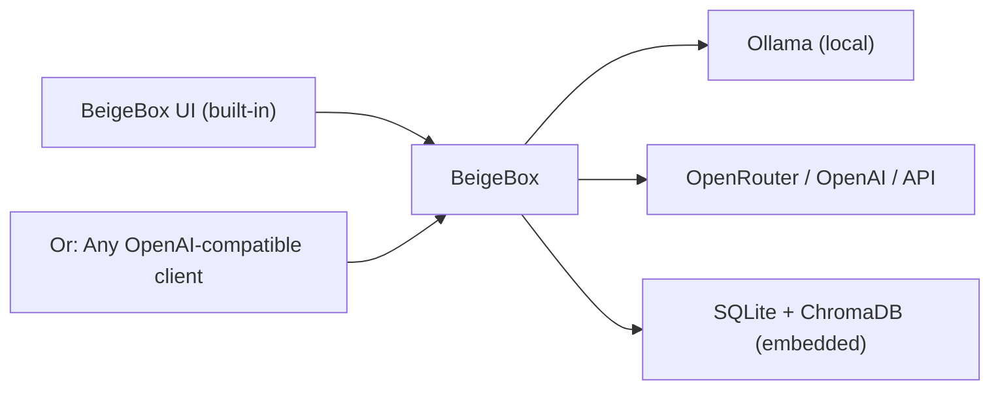

# BeigeBox

Modular, OpenAI-compatible LLM middleware. Sits between your frontend and your model providers — handles routing, orchestration, caching, logging, evaluation, and policy decisions while remaining transparent to both sides.

**Tap the line. Control the carrier.**



**Current version: 1.9**

---

## Quick Start

```bash
git clone --recursive https://github.com/ralabarge/beigebox.git
cd beigebox/docker
cp env.example .env        # optional — set GPU, ports, API keys
cp docker-compose.example.yaml docker-compose.yaml
cp ../config.example.yaml ../config.yaml
docker compose up -d
```

Open **http://localhost:1337** for the web UI. The OpenAI API is at `http://localhost:1337/v1`.

### Profiles

| Profile | Command | What it adds |
|---|---|---|
| default | `docker compose up -d` | Ollama + BeigeBox (full stack) |
| cdp | `--profile cdp up -d` | Chrome automation (operator tools) |
| voice | `--profile voice up -d` | Whisper (STT) + Kokoro (TTS) |
| engines-* | `--profile engines-cpp up -d` | Alternative inference (llama.cpp, vLLM, ExecutorTorch) |

See [Deployment Quickstart](docs/deployment.md#quick-start) for more.

---

## What's in the box

| Feature | What it does |
|---|---|
| **Routing** | Smart backend selection: Z-commands → embedding classifier → decision LLM → multi-backend router with latency awareness and A/B splitting |
| **Caching** | Session + semantic caching; context window auto-summarization |
| **Observability** | Tap unified logging (18+ event types); Grafana dashboards; per-request tracing |
| **Orchestration** | Harness multi-turn harness; ensemble parallel execution; multi-agent coordination |
| **Storage** | SQLite (conversations, metrics) + ChromaDB (embeddings); hot-reload config |
| **Tools** | Chrome DevTools Protocol; operator agentic tools; RAG via document search; plugins + MCP |
| **Post-processing** | WASM module support; output normalization; streaming transforms |

---

## Security by default

BeigeBox assumes supply chain compromise is inevitable. Three-layer defense:

1. **Prevention** — hash-locked deps (3,280 hashes), pinned images (digest), CVE scanning
2. **Containment** — read-only root, network segmentation, capability drop, unprivileged user
3. **Detection** — comprehensive Tap logging, metrics, automated git hooks

Result: Compromised code gets **trapped in-memory, detected in 0.1s, cannot persist**.

### Scanning toolchain

Integrated security scanners run via a single command:

```bash
./scripts/security-scan.sh          # full scan (deps + code + secrets + containers)
./scripts/security-scan.sh --quick  # Python-only (pip-audit + bandit + semgrep)
```

| Scanner | What it checks |
|---|---|
| **pip-audit** | Known CVEs in Python dependencies |
| **bandit** | Static security analysis of source code |
| **semgrep** | Advanced pattern-based vulnerability detection |
| **gitleaks** | Secrets accidentally committed to git history |
| **trivy** | OS and app-level CVEs in Docker images |

Security hardening is **feature-complete** as of v1.9. Remaining low-priority items are tracked in [TODO-security.md](TODO-security.md).

See [Security](docs/security.md) for threat model, defense strategy, and detailed hardening.

---

## Documentation

- **[Security](docs/security.md)** — Supply chain hardening, read-only root, network segmentation, threat model, defense layers
- **[Configuration](docs/configuration.md)** — config.yaml, runtime_config.yaml, feature flags, per-model options
- **[Routing & Backends](docs/routing.md)** — Routing tiers, latency-aware selection, A/B splitting, custom rules
- **[Authentication](docs/authentication.md)** — API keys, multi-key setup, ACLs, agentauth keychain
- **[CLI & Z-Commands](docs/cli.md)** — Command-line tools and inline command prefixes
- **[Observability](docs/observability.md)** — Tap event types, metrics, debugging
- **[Agents & Tools](docs/agents.md)** — Operator, orchestration, multi-turn, group chat, RAG
- **[Tools & Integrations](docs/tools.md)** — CDP, plugins, MCP server, document search
- **[Deployment](docs/deployment.md)** — Docker Compose, Kubernetes, Systemd, production setup
- **[API Reference](docs/api-reference.md)** — Endpoints, request/response formats, examples

---

## Architecture

BeigeBox's architecture is **transparent** — every request flows through a deterministic pipeline:

1. **Z-command parsing** — user `z: <cmd>` overrides
2. **Hybrid routing** — session cache → embedding classifier → decision LLM → backend router
3. **Auto-summarization** — context window management
4. **System injection** — hot-loaded context, model options, window config
5. **Semantic cache lookup** — token savings via embedding-based deduplication
6. **Stream to backend** — buffered if WASM active
7. **Post-stream transforms** — WASM normalization → cache store

See [Architecture](docs/architecture.md) for the full pipeline and subsystem map.

---

## Development

```bash
pip install -e .
beigebox dial                          # production mode
uvicorn beigebox.main:app --reload     # dev mode with auto-reload
pytest                                 # run all tests
beigebox bench                         # benchmark inference speed
```

See [CLAUDE.md](CLAUDE.md) for development guidelines and commands.

---

## Deployment

BeigeBox ships with production-ready deployment options:

| Method | Best for |
|---|---|
| **Docker Compose** | Single-host, persistent volumes, env-based config |
| **Kubernetes** | Multi-node clusters, auto-scaling, managed upgrades |
| **Systemd (bare metal)** | Linux servers, minimal overhead, VirtualEnv isolation |

All include health checks, security hardening, and persistent data. See [deploy/README.md](deploy/README.md).

---

## License

Dual-licensed: **AGPL-3.0** (source available) and **Commercial** (proprietary).

For proprietary use cases, reach out — licensing is negotiable.

See [LICENSE.md](LICENSE.md) and [COMMERCIAL_LICENSE.md](COMMERCIAL_LICENSE.md).

---

## Community

- **Issues**: [GitHub Issues](https://github.com/ralabarge/beigebox/issues)
- **Discussions**: [GitHub Discussions](https://github.com/ralabarge/beigebox/discussions)
- **Skills**: 187 skills via [Anthropic Skills + K-Dense scientific library](https://github.com/anthropics/anthropic-sdk-python/tree/main/examples/skills)

---

**Want to contribute?** See [CONTRIBUTING.md](CONTRIBUTING.md) (if present) or open an issue.
