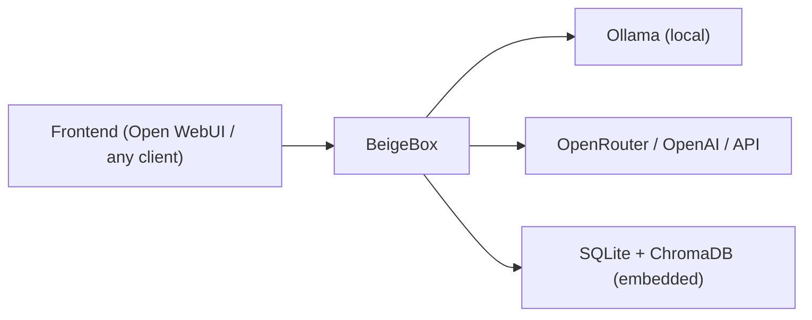
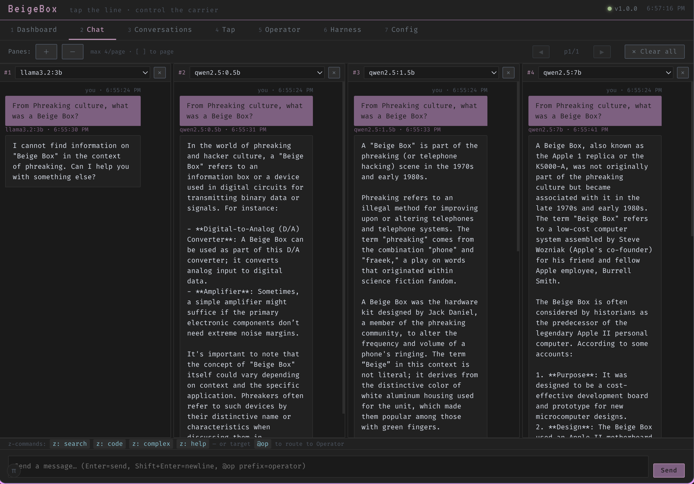
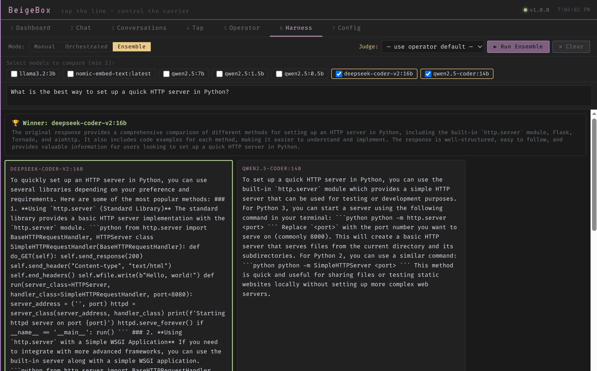

# BeigeBox

Modular, OpenAI-compatible LLM middleware. Sits between your frontend and your model providers — handles routing, orchestration, caching, logging, evaluation, and policy decisions while remaining transparent to both sides.

Tap the line. Control the carrier.



---

## Quick Start

```bash
git clone --recursive https://github.com/ralabarge/beigebox.git
cd beigebox/docker
cp env.example .env        # optional — set GPU, ports, API keys
docker compose up -d
```

The `--recursive` flag initializes the community skill submodules (187 skills across
Anthropic's official collection and K-Dense's scientific library). Skip it if you
don't need them. If you already cloned without it: `git submodule update --init --recursive`.

This brings up three services plus a one-shot model pull:

| Service | Port | What it does |
|---|---|---|
| Ollama | `11434` | Local model inference |
| **BeigeBox** | `1337` | Middleware proxy + API + web UI + embedded vector store |
| Open WebUI | `3000` | Chat frontend (talks to BeigeBox, not Ollama directly) |

Open **http://localhost:1337** for BeigeBox's built-in web interface, or **http://localhost:3000** for Open WebUI.

The OpenAI-compatible API is at `http://localhost:1337/v1` — point any client at it.

### Voice support

```bash
docker compose --profile voice up -d
```

Adds Whisper (STT) on `:9000` and Kokoro (TTS) on `:8880` as sidecars. Enable in the Config tab or `runtime_config.yaml`.

### GPU acceleration

Uncomment the `deploy` block on the `ollama` service in `docker-compose.yaml` and restart. For per-model GPU layer control see [Per-model options](#per-model-options) below.

---

## What you get

Because all LLM traffic passes through BeigeBox, it can observe, route, modify, store, and orchestrate everything without your frontend or backend knowing it exists.

### Routing

Multi-tier routing pipeline that picks the right model per request:

1. **Z-commands** — user overrides inline (`z: complex`, `z: code`, `z: llama3:8b`)
2. **Routing rules** — admin-configured rules in `runtime_config.yaml`, hot-reloaded per request (see [Routing rules](#routing-rules))
3. **Agentic scorer** — zero-cost keyword pre-filter for tool-heavy queries
4. **Embedding classifier** — fast cosine-distance classification (~50ms) handles clear cases
5. **Decision LLM** — small local model judges borderline cases

Session-sticky routing keeps a conversation on the same model once classified. Multi-backend failover routes through Ollama, OpenRouter, or any OpenAI-compatible endpoint with priority-based fallback.

**Latency-aware routing** — each backend maintains a rolling P95 latency window (100 samples). Backends whose P95 exceeds a configurable threshold are deprioritised to a second-pass fallback, keeping traffic on healthy backends automatically.

**A/B traffic splitting** — assign `traffic_split` weights to backends for percentage-based traffic distribution. When weights are set, BeigeBox uses weighted random selection among healthy backends instead of strict priority order.

### Caching

Three complementary cache layers, all in-process:

- **Semantic cache** — caches full assistant responses keyed by cosine similarity of the user query (nomic-embed-text). When a new message is sufficiently similar to a cached one, the cached response is returned immediately without touching the backend. Configurable similarity threshold, TTL, and max entries.
- **Embedding cache** — deduplicates identical embedding calls within a session. Both the classifier and semantic cache need to embed the same message — this avoids redundant round-trips to Ollama.
- **Tool result cache** — short-TTL cache for deterministic tool calls (web search, calculator, datetime). Keyed by SHA-256 of tool name + query.
- **RAG query preprocessing** — optional fast LLM pass before ChromaDB lookup extracts keywords and entities from the raw query, improving recall for vague or conversational memory searches. Enable via `tools.memory.query_preprocess` in config.

### Observability

- **Wiretap** — structured JSONL log of every request, response, routing decision, tool call, WASM transform, timing breakdown, and all passthrough routes; operator tool calls and council member responses are also logged (operator and council call Ollama directly — wiretap coverage is added at the endpoint level in `main.py`); filterable by role (`user`, `assistant`, `system`, `decision`, `tool`, `proxy`, `wasm`) and direction in the Tap tab
- **TTFT tracking** — time to first token captured on every streaming response, stored in SQLite
- **Latency percentiles** — P50/P90/P95/P99 per model surfaced in the Dashboard performance table and latency chart
- **Tokens/sec** — uses `tokens / (latency - TTFT)` for generation throughput (excludes prompt processing time)
- **Cost tracking** — per-request, per-model, per-day spend for API backends (OpenRouter cost extraction built in)
- **Backend health** — rolling P95 + degraded status per backend in `/api/v1/backends` and Dashboard

### Orchestration

- **Harness** — send the same prompt to N models in parallel, compare results side by side
- **Orchestrated mode** — goal-driven agent loop: plan → dispatch tasks to models/operator → evaluate → iterate
- **Ensemble voting** — parallel responses judged by an LLM arbiter; always streams tokens as they arrive; built-in question bank (25 curated benchmark questions across math, logic, coding, reasoning, and knowledge) with category filter and random picker; **Challenge round** button asks all models to verify their answer, reruns the judge, and shows whether winners are consistent — useful for comparing quantised vs full-precision models
- **Group Chat** — turn-by-turn multi-agent conversation: an LLM moderator picks who speaks next from a configurable roster of models/operator agents; inject thoughts mid-conversation to steer the discussion
- **Council mode** — "council then commander": operator proposes a specialist council (name, model, task) for any query; select which models the council may use from a checklist (leave all unchecked to allow any); user reviews and edits council members via dropdowns before engaging; specialists run in parallel, operator synthesises results into a final answer; **model affinity batching** groups same-model members to run in parallel while dispatching model groups sequentially — prevents Ollama VRAM thrashing and roughly halves latency for typical 4-member/2-model councils; **kill button** aborts the SSE stream mid-run; individual cards can be closed or added on the fly
- **Operator agent** — JSON tool-loop agent with sandboxed shell, web search, memory recall, calculator, and plugin tools; streaming mode shows tool calls and results as they happen; maintains multi-turn conversation history; **TIR mode** runs Python code in a bwrap sandbox (stdin-pipe, no tempfile) and feeds stdout back as an observation; **ReAct fallback** parses `Thought:/Action:/Final Answer:` text when JSON output fails; **persistent notes** — operator can write `workspace/out/operator_notes.md` for cross-session memory (injected at session start without an extra LLM call); **notes panel** in the UI lets you read and edit notes directly
- **Operator pre-hook** — optional pre-processing pass where the operator enriches every incoming chat message before it reaches the LLM; uses tools (memory recall, web search, system info, etc.) and replaces the message with a context-enriched version; enable with `operator.pre_hook.enabled: true`; max iterations configurable to keep latency low; visible in the Tap tab as `internal/proxy` entries; tool I/O dumped to `workspace/out/.prehook/` (not indexed)
- **Operator post-hook** — fire-and-forget operator pass that runs after the LLM has fully responded; receives the completed response so the operator can extract facts, write notes, or trigger side effects; never modifies the response; enable with `operator.post_hook.enabled: true`; tool I/O dumped to `workspace/out/.posthook/`
- **Operator tool capture** — operator tool calls can opt in to full I/O capture; raw result stored in the blob store, preview embedding in ChromaDB for semantic retrieval; per-tool opt-in via `capture_tool_io = True` class attribute; `max_context_chars` limits what the operator sees while storing full content; enabled on web_search, web_scraper, pdf_reader, browserbox, python_interpreter

### Storage

- **SQLite** — every conversation, message, cost, and latency metric persisted locally; WAL mode enabled for concurrent read performance
- **ChromaDB** — vector embeddings for semantic search and classification (embedded, no separate service); stores conversation messages, document chunks, and operator tool results in a single collection separated by `source_type` metadata
- **Blob store** — content-addressed gzip store at `{vector_store_path}/blobs/`; sha256 filename = identity; natural dedup; used for full operator tool results and document chunk source text; verbatim retrieval by hash
- **Document RAG** — files uploaded to `workspace/in/` are automatically chunked, embedded, and indexed; retrievable by the operator via the `document_search` tool; paragraph-aware chunking with overlap; PDF support via pdf_oxide
- **Conversation replay** — reconstruct any conversation with full routing context
- **Conversation forking** — branch a conversation into a new thread via `z: fork`

### Post-processing (WASM)

- **WASM transform modules** — drop a compiled `.wasm` (WASI target) into `wasm_modules/` and route responses through it; modules read the full response from stdin and write modified output to stdout
- **Streaming-correct** — when a WASM module is active, BeigeBox buffers the full stream internally, runs the transform, then re-emits to the client; the client always sees the transformed content, not the raw stream
- Any language that compiles to WASI works (Rust, C, Go, AssemblyScript)
- Timeout-enforced (configurable `timeout_ms`) — if the module times out, the original response passes through unmodified
- Decision LLM can suggest WASM modules per route via `[suggest wasm: <module>]` hints in the routing prompt
- Included modules (pre-compiled, drop-in):
  - `opener_strip` — strips sycophantic openers ("Certainly!", "Of course!", etc.)
  - `json_extractor` — extracts the first valid JSON object/array from mixed prose+JSON responses; handles raw JSON, code fences, and inline JSON
  - `markdown_stripper` — strips Markdown formatting to plain text; useful for TTS pipelines where `**bold**` would be read aloud literally
  - `pii_redactor` — redacts emails, US phone numbers, SSNs, and credit card numbers with labelled placeholders (`[REDACTED_EMAIL]`, etc.)
  - `passthrough` — identity transform; reference implementation for writing new modules

### Hooks & Plugins

- **Pre/post hooks** — Python scripts that intercept requests and responses (prompt injection detection, RAG context injection, synthetic request filtering)
- **Plugin system** — drop a `*Tool` class in `plugins/` and it auto-registers into the tool registry
- **Zip inspector** — built-in plugin that reads `.zip` files from `workspace/in/`, returns file tree and UTF-8 text previews
- **Document parser** — built-in plugin (`doc_parser`) converts PDF, DOCX, PPTX, XLSX, HTML, images, and more to Markdown via MarkItDown; OCR via Tesseract or any Ollama vision model; chunks ingested into ChromaDB for `z: memory` recall
- **System context injection** — hot-reloaded `system_context.md` prepended to every request

### Per-model options

Override Ollama inference settings per model name in `config.yaml`. Useful for GPU layer budgeting across multiple models:

```yaml
models:
  llama3.2:3b:
    options:
      num_gpu: 99          # offload all layers to GPU
  llama2:70b:
    options:
      num_gpu: 20          # partial offload — stay within VRAM budget
  mistral:7b:
    options:
      num_gpu: 0           # force CPU inference
      num_ctx: 8192
```

Any key in `options` is passed to Ollama's model loader. Settings take effect on next model load; use the **↺ reload** checkbox in the chat pane settings drawer to evict and reload immediately.

---

## Web UI



BeigeBox includes a built-in single-file web interface at `http://localhost:1337` with seven tabs:

| Tab | What it does |
|---|---|
| **Dashboard** | Storage stats, model performance charts (P50/P90/P99, TTFT), cost breakdown, backend health with rolling P95 |
| **Chat** | Multi-pane streaming chat — fan out to N models simultaneously, per-pane settings |
| **Conversations** | Semantic search, replay, fork, export |
| **Tap** | Live wiretap stream with role/direction filters |
| **Operator** | Interactive agent with tool execution |
| **Harness** | Parallel model comparison + orchestrated goal-driven mode + ensemble voting + group chat |
| **Config** | Full config editor with collapsible sections, hot-reload — every setting, feature flag, and generation parameter |

### Per-pane chat settings

Each chat pane has an independent ⚙ settings drawer. Configure separately per window:

| Setting | What it controls |
|---|---|
| Temperature, Top-P, Top-K | Sampling parameters for this pane only |
| Ctx, Max tokens, Repeat penalty | Context and output size overrides |
| GPU layers | `options.num_gpu` sent to Ollama for this pane's requests |
| **↺ reload** | Checkbox — evicts the model from VRAM before the next send so it reloads fresh with the new GPU layer count (one-shot, auto-clears) |
| System prompt | Per-pane system message, replaces the global system context for this window |

All settings inherit from global config when left blank. The ⚙ button glows when any non-default setting is active.

**Status bar** — the header status bar shows a live context token counter (`~Nk tok`) that updates after each message; colour-coded neutral → yellow (12k) → red (24k). The vi-mode toggle is an inline `π` pill in the same bar — hover to see state, click to toggle.

**Z-command help** — a `z: ?` button left of the chat textarea shows a CSS-only hover popover listing all available z-commands grouped by category (routing, tools, special, custom). Content is fetched once from `/api/v1/zcommands` at page load — custom commands added to `config.yaml` appear automatically.

Optional vi-mode keybindings. Mobile-responsive. No JavaScript dependencies.



---

## CLI

Phreaker-themed commands, each with standard aliases:

```
beigebox dial          Start the proxy server (aliases: start, serve, up)
beigebox tap           Live wiretap stream (aliases: log, tail, watch)
beigebox ring          Ping a running instance (aliases: status, ping, health)
beigebox sweep         Semantic search over conversations (aliases: search, find)
beigebox dump          Export conversations to JSON (aliases: export)
beigebox flash         Stats and config at a glance (aliases: info, config, stats)
beigebox operator      Launch the operator agent (aliases: op)
beigebox setup         Pull required models into Ollama (aliases: install, pull)
beigebox build-centroids  Build embedding classifier centroids
beigebox tone          Print the banner
```

---

## Z-Commands

Prefix any chat message with `z:` to override routing, force tools, or branch conversations:

```
z: simple              Route to the fast model
z: complex             Route to the large model
z: code                Route to the code model
z: llama3:8b           Route to an exact model
z: search              Force web search and inject results
z: memory              Search past conversations for context
z: calc 2^32           Evaluate a math expression
z: sysinfo             Get system resource stats
z: fork                Fork this conversation into a new branch
z: complex,search      Chain multiple directives
z: help                Show all available commands
```

---

## Configuration

Two config files, by design:

- **`config.yaml`** — permanent infrastructure settings (backends, storage paths, model names, security policies). Loaded once at startup.
- **`runtime_config.yaml`** — session overrides (default model, temperature, voice toggle, vi mode). Hot-reloaded on every request via mtime check — no restart needed.

Everything in both files is editable from the web UI Config tab (collapsible sections, Save & Apply button).

### Key feature flags (all disabled by default)

```yaml
decision_llm.enabled: false       # Multi-tier routing pipeline
operator.enabled: false           # LLM-driven tool execution (review allowed_tools first)
auto_summarization.enabled: false # Context window management
cost_tracking.enabled: false      # Per-request spend tracking
backends_enabled: false           # Multi-backend routing with failover
web_ui.voice_enabled: false       # Push-to-talk STT/TTS
wasm.enabled: false               # WASM post-processing transform modules
semantic_cache.enabled: false     # Semantic response caching
```

### API key authentication

```yaml
auth:
  api_key: ""   # empty = disabled; set to a secret string to protect all endpoints
```

Accepts the key via `Authorization: Bearer <key>`, `api-key` header, or `?api_key=` query param. The web UI and health check endpoints are always exempt.

### A/B traffic splitting

```yaml
backends:
  - name: ollama-local
    traffic_split: 70    # 70% of traffic
  - name: vllm-secondary
    traffic_split: 30    # 30% of traffic
```

### Latency-aware routing

```yaml
backends:
  - name: ollama-local
    latency_p95_threshold_ms: 3000   # deprioritise if rolling P95 exceeds 3s
```

### Routing rules

Rules defined in `runtime_config.yaml` under `routing_rules`. Hot-reloaded on every request — edit the file and the next request picks up the change immediately. Rules fire after z-commands and before the embedding classifier.

Each rule has a `match` block (all conditions must be true) and an `action` block. The first matching rule wins unless `continue: true` is set. `priority` controls evaluation order (lower = first, default 50).

**Match conditions:**

| Field | Type | Matches when… |
|---|---|---|
| `message` | regex | latest user message matches (case-insensitive) |
| `message_contains` | string | latest user message contains substring |
| `model` | glob | requested model matches (e.g. `qwen3:*`, `gpt-4*`) |
| `auth_key` | string | API key name matches exactly |
| `has_tools` | bool | request includes / excludes a `tools` array |
| `message_count` | `{min: N, max: N}` | conversation has N messages |
| `conversation_id` | regex | conversation ID field matches |

**Actions:**

| Key | Effect |
|---|---|
| `model` | Override the model |
| `backend` | Force a specific named backend (bypasses latency-aware selection) |
| `route` | Resolve a named route alias from `decision_llm.routes` |
| `tools` | Force-run tool list, inject results as context before the LLM call |
| `pass_through` | Apply other actions but still run classifier / decision LLM for model selection |
| `temperature`, `top_p`, `top_k`, `num_ctx`, `max_tokens`, `repeat_penalty`, `seed` | Override generation params |
| `system_prompt` | Prepend text to the system message |
| `inject_file` | Read a file from disk and prepend to system message — re-read every request, so edits take effect immediately |
| `inject_context` | Inline text prepended to system message |
| `skip_session_cache` | Don't sticky this routing decision for the conversation |
| `skip_semantic_cache` | Bypass semantic cache lookup for this request |
| `tag` | Label added to the wiretap entry (`routing_rule_tag`) |

```yaml
# runtime_config.yaml — takes effect immediately, no restart
runtime:
  routing_rules:

    # Inject a project README into every request — still let the classifier pick the model
    - name: "always have project context"
      match:
        auth_key: "dev"
      action:
        inject_file: "/home/user/project/README.md"
        pass_through: true

    # Route code requests to a larger model with tighter sampling
    - name: "code → big model"
      priority: 10
      match:
        message: "^(fix|debug|refactor|implement)"
      action:
        model: "qwen3:14b"
        temperature: 0.1
        num_ctx: 32768
        tag: "code"

    # Per-key model restriction with fresh responses
    - name: "ci runner — fast model only"
      match:
        auth_key: "ci-runner"
      action:
        model: "llama3.2:3b"
        skip_semantic_cache: true
        skip_session_cache: true

    # Multiple rules can layer with continue: true
    - name: "add context to all dev requests"
      match:
        auth_key: "dev"
      action:
        inject_context: "You are working on a Python FastAPI project."
      continue: true                    # keep evaluating subsequent rules

    - name: "also route dev code requests to big model"
      match:
        auth_key: "dev"
        message: "fix|refactor"
      action:
        model: "qwen3:14b"
```

The full schema with every accepted key and inline documentation is in `beigebox/agents/routing_rules.py`.

### OpenRouter plain model IDs

By default, plain model IDs (no `/`) are not sent to OpenRouter backends. To allow it:

```yaml
# Per-backend (config.yaml):
backends:
  - name: openrouter
    allow_unqualified_models: true

# Or globally (runtime_config.yaml, hot-reloaded):
runtime:
  allow_openrouter_for_plain_models: true
```

Useful when you want to route e.g. `llama3.2` to OpenRouter without prefixing it as `meta-llama/llama-3.2`.
Slug-prefixed IDs (`meta-llama/llama-3.2`) always route to OpenRouter regardless of this flag.

---

## Credentials (agentauth)

BeigeBox uses [agentauth](https://github.com/RALaBarge/agentauth) for authenticated API calls from the operator. Tokens live in the OS native keychain — agents call connections by name and never see raw credentials.

```bash
pip install agentauth
agentauth add github        # stores in keychain, prompts with hidden input
```

```yaml
# config.yaml
connections:
  github:
    type: bearer
    base_url: https://api.github.com
    tier: 1                 # 1=read, 2=write, 3=send (needs human confirmation)
    allowed_paths:
      - /user/**
      - /repos/**
```

The operator's `connection` tool lets the agent call any configured connection. Token injection and path allowlist enforcement happen internally. See [agentauth](https://github.com/RALaBarge/agentauth) for the full CLI reference, tier system, and predefined connection configs.

---

## Group Chat

Turn-by-turn multi-agent conversation where an LLM moderator decides who speaks next. Unlike the parallel Harness, agents see each other's responses and can build on them.

Configure a roster of speakers — each with a name, a description of their role or personality, and a target (any model ID or `"operator"`). The moderator LLM reads the shared transcript each turn and picks who speaks next, stopping when the discussion reaches a natural conclusion or the turn limit is hit.

**Inject thoughts mid-run** — while a conversation is in progress, type into the inject bar and press Enter. The moderator factors your note in before selecting the next speaker and acknowledges it in the transcript.

**API:**

```
POST /api/v1/harness/group-chat

{
  "topic":    "What are the trade-offs between RAG and fine-tuning?",
  "speakers": [
    {"name": "Advocate",  "description": "Argues strongly for RAG-based approaches", "target": "llama3.2:3b"},
    {"name": "Skeptic",   "description": "Challenges RAG limitations, prefers fine-tuning", "target": "qwen3:8b"},
    {"name": "Moderator", "description": "Synthesises and finds common ground", "target": "operator"}
  ],
  "model":     "llama3.2:3b",
  "max_turns": 12
}
```

Returns `text/event-stream` events: `start`, `moderator`, `turn`, `injected`, `finish`, `error`.

Inject a thought into a running session:

```
POST /api/v1/harness/{run_id}/inject
{"message": "focus on latency trade-offs specifically"}
```

The inject endpoint is shared with the Orchestrated and Ralph modes.

---

## BrowserBox (browser API)

BeigeBox's operator agent can control a live Chrome browser via [BrowserBox](https://github.com/RALaBarge/browserbox) — a Chrome extension + WebSocket relay that exposes browser APIs as tools.

With BrowserBox enabled, the operator can navigate pages, read DOM content, click elements, capture screenshots, intercept network traffic, run JavaScript, and fetch authenticated PDFs — all against the real browser session.

**Setup:**

```bash
# 1. Start the relay (in the browserbox repo)
pip install websockets
python ws_relay.py                    # ws://localhost:9009  +  http://localhost:9010/tools

# Docker: relay must bind to 0.0.0.0 so the container can reach it
python ws_relay.py --host 0.0.0.0

# 2. Load the Chrome extension (chrome://extensions → Load unpacked → browserbox/)
```

**Enable in `config.yaml`:**

```yaml
tools:
  enabled: true
  browserbox:
    enabled: true
    ws_url: ws://localhost:9009       # bare metal / dev
    # ws_url: ws://host.docker.internal:9009   # Docker — relay must use --host 0.0.0.0
    timeout: 10
```

When running BeigeBox in Docker, the `ws_url` must use `host.docker.internal` instead of `localhost`. Set `BROWSERBOX_WS_URL=ws://host.docker.internal:9009` in your `.env` file — docker-compose passes it through automatically.

The operator calls it with JSON: `{"tool": "namespace.method", "input": {...}}`. Start with `dom.snapshot` to orient on the active page. `pdf.extract` results are automatically saved to `workspace/in/` so the `pdf_reader` tool can process them.

**Reliability note (v1.2.3):** Chrome MV3 service workers can be killed after ~30s of inactivity. BrowserBox now sends a `{"type":"ping"}` keepalive every 20s via `setInterval` to keep the SW alive (more reliable than Chrome alarms, which round up to 1 minute for unpacked extensions). The relay silently drops ping/pong frames. The `browserbox.py` tool uses a deadline-tracked `asyncio.wait_for` receive loop instead of an unbounded `async for` — so a dead extension is detected within the configured timeout rather than hanging forever.

Available namespaces: `dom`, `tabs`, `nav`, `fetch`, `storage`, `clip`, `network`, `inject`, `pdf` (40 tools total). Full schema: `GET http://localhost:9010/tools`.

---

## Multi-key auth

BeigeBox supports named API keys with per-key model ACLs, endpoint ACLs, and rate limits. Tokens live in the OS native keychain via [agentauth](https://github.com/RALaBarge/agentauth) — never in config files.

```yaml
# config.yaml
auth:
  api_key: ""          # legacy single key — still works
  keys:
    - name: openwebui
      allowed_models: ["*"]
      allowed_endpoints: ["*"]
    - name: ci-runner
      allowed_models: ["llama3.2", "qwen3:*"]
      allowed_endpoints: ["/v1/chat/completions", "/v1/models"]
      rate_limit_rpm: 60
    - name: mcp-client
      allowed_models: ["*"]
      allowed_endpoints: ["/mcp", "/v1/models"]
```

Store tokens:

```bash
agentauth add openwebui        # prompts for token, stores in OS keychain
export BB_CI_RUNNER_TOKEN=...  # env var alternative for headless/Docker
```

Accepted via `Authorization: Bearer <token>`, `api-key` header, or `?api_key=` query param. Web UI and health check endpoints are always exempt.

---

## MCP server

BeigeBox exposes its full tool registry as an [MCP (Model Context Protocol)](https://modelcontextprotocol.io) server via `POST /mcp`. Any MCP client — Claude Desktop, Claude Code, or custom agents — can discover and call BeigeBox tools directly.

**Claude Desktop** (`claude_desktop_config.json`):

```json
{
  "mcpServers": {
    "beigebox": {
      "url": "http://localhost:1337/mcp",
      "headers": {"Authorization": "Bearer YOUR_KEY"}
    }
  }
}
```

Supported MCP methods: `initialize`, `tools/list`, `tools/call`.

All tools registered in BeigeBox's tool registry (web search, calculator, memory recall, BrowserBox, connections, plugins, etc.) are automatically available as MCP tools. No additional configuration required — enable the tools you want in `config.yaml` and they appear in `tools/list`.

---

## Security

- **Operator sandboxing** — disabled by default; when enabled, tool access is restricted via `operator.allowed_tools` config
- **Shell hardening** — Python allowlist → bwrap namespace sandbox → busybox wrapper fallback → audit logging (four layers)
- **Prompt injection hooks** — configurable detection with scoring and blocking
- **Multi-key API auth** — per-key model ACLs, endpoint ACLs, and rate limits; tokens stored in OS keychain via agentauth, never in config files
- **Non-root container** — runs as `appuser` (UID 1000)
- **No network in sandbox** — bwrap `--unshare-all` isolates shell commands from the network
- **Blocked patterns** — belt-and-suspenders regex blocking on top of the allowlist
- **Agent workspace** — `workspace/in/` is a tmpfs (RAM-only, never touches disk, auto-cleared on container stop); `workspace/out/` is a bind-mount for persistent agent results. Upload files to `workspace/in/` via the dashboard drag-and-drop zone or `POST /api/v1/workspace/upload`

---

## API

OpenAI-compatible endpoints — any client that speaks the OpenAI API works without modification:

```
POST /v1/chat/completions       Chat (streaming and non-streaming)
GET  /v1/models                 List available models
POST /v1/embeddings             Embeddings passthrough
POST /v1/audio/transcriptions   STT (routes to Whisper when voice profile active)
POST /v1/audio/speech           TTS (routes to Kokoro when voice profile active)
```

BeigeBox-specific endpoints:

```
GET  /api/v1/config                     Full merged config
POST /api/v1/config                     Hot-apply config changes
GET  /api/v1/stats                      Storage and usage statistics
GET  /api/v1/costs                      Cost breakdown by model/day/conversation
GET  /api/v1/search                     Semantic search grouped by conversation
GET  /api/v1/tap                        Wiretap log stream
GET  /api/v1/backends                   Backend health, rolling P95, degraded status
GET  /api/v1/model-performance          Tokens/sec, P50/P90/P95/P99 latency, TTFT, cache stats
GET  /api/v1/routing-stats              Session cache hit rate
POST /api/v1/operator                   Run the operator agent (blocking)
POST /api/v1/operator/stream            Run the operator agent with streaming progress (SSE)
GET  /api/v1/operator/notes             Read operator persistent notes (workspace/out/operator_notes.md)
POST /api/v1/operator/notes             Write operator persistent notes
```

### Operator hooks

**Pre-hook** — intercept and enrich every chat message before it reaches the LLM:

```yaml
operator:
  pre_hook:
    enabled: true
    model: "qwen3:4b"      # model used for enrichment
    max_iterations: 3      # keep it fast
```

When active, each message passes through a lightweight operator loop that can call tools (memory recall, web search, system info, etc.) and return an enriched version. The main LLM sees the enriched message. Enrichment steps are logged to the Tap tab as `internal/proxy` entries. Tool I/O is dumped to `workspace/out/.prehook/` — not indexed in the vector store.

**Post-hook** — fire-and-forget pass that runs after the LLM has fully responded:

```yaml
operator:
  post_hook:
    enabled: true
    model: "qwen3:4b"
    max_iterations: 3
```

Receives the completed user message + assistant response. Can extract facts, write to operator notes, update workspace files, or trigger any tool-based side effect. Never modifies the response — always fire-and-forget. Tool I/O dumped to `workspace/out/.posthook/`.

```
POST /api/v1/ensemble                   Multi-model ensemble with LLM judge
POST /api/v1/harness/orchestrate        Goal-driven orchestration (SSE stream)
POST /api/v1/harness/group-chat         Turn-by-turn multi-agent group conversation (SSE stream)
POST /api/v1/council/propose            Council mode phase 1: operator proposes specialist council
POST /api/v1/council/{run_id}/engage    Council mode phase 2: dispatch council + stream results (SSE)
POST /api/v1/harness/{run_id}/inject    Inject a steering thought into a running orchestration or group chat
GET  /api/v1/conversation/{id}/replay   Full conversation reconstruction
POST /api/v1/conversation/{id}/fork     Branch a conversation
GET  /api/v1/workspace                  List workspace/in and workspace/out files
POST /api/v1/workspace/upload           Upload a file to workspace/in (multipart)
DELETE /api/v1/workspace/out/{file}     Delete a file from workspace/out
GET  /api/v1/zcommands                  Available z-commands (routing, tools, specials, custom from config)
GET  /api/v1/openrouter/balance         Remaining credit balance for configured OR key
POST /api/v1/build-centroids            Rebuild embedding classifier centroids
POST /mcp                               MCP server (Model Context Protocol, Streamable HTTP)
```

Ollama-native endpoints (`/api/tags`, `/api/chat`, `/api/generate`, etc.) are forwarded transparently. A catch-all route forwards anything not explicitly handled — BeigeBox stays invisible.

---

## Project Structure

```
beigebox/
├── main.py                 FastAPI app — all endpoints
├── proxy.py                Core proxy — routing, streaming, hooks, WASM, caching, logging
├── auth.py                 Multi-key auth registry (agentauth-backed, per-key ACLs + rate limits)
├── mcp_server.py           MCP server (Streamable HTTP, exposes tool registry as MCP tools)
├── cache.py                SemanticCache, EmbeddingCache, ToolResultCache
├── config.py               Config loader with hot-reload
├── cli.py                  CLI entry point
├── costs.py                Cost tracking
├── hooks.py                Pre/post hook manager
├── orchestrator.py         Parallel task orchestrator
├── replay.py               Conversation replay
├── summarizer.py           Auto-summarization
├── system_context.py       System prompt injection
├── wasm_runtime.py         WASM module loader and async transform runner
├── wiretap.py              Structured wire logging
├── agents/
│   ├── decision.py         Decision LLM (Tier 4 routing)
│   ├── embedding_classifier.py  Centroid classifier (Tier 3)
│   ├── agentic_scorer.py   Keyword pre-filter (Tier 2)
│   ├── zcommand.py         Z-command parser (Tier 1)
│   ├── operator.py         JSON tool-loop agent (TIR, ReAct fallback, persistent notes)
│   ├── council.py          Council mode — propose + engage, model affinity batching
│   ├── harness_orchestrator.py  Goal-driven orchestration
│   └── ensemble_voter.py   Multi-model voting with LLM judge
├── backends/
│   ├── router.py           Multi-backend router — failover, latency-aware, A/B splitting
│   ├── ollama.py           Ollama backend
│   ├── openai_compat.py    Generic OpenAI-compatible backend
│   ├── openrouter.py       OpenRouter (with cost extraction)
│   └── retry_wrapper.py    Retry logic with exponential backoff
├── storage/
│   ├── sqlite_store.py     Conversation + metrics persistence (TTFT, P50/P90/P99, WAL mode)
│   ├── vector_store.py     Embedding + semantic search (messages, documents, tool results)
│   ├── blob_store.py       Content-addressed gzip store (sha256 filenames, natural dedup)
│   ├── chunker.py          Paragraph-aware text chunker for document indexing
│   └── backends/           Vector backend abstraction (ChromaDB, extensible)
├── tools/
│   ├── registry.py         Tool dispatch + plugin loading
│   ├── system_info.py      System stats (bwrap sandboxed)
│   ├── memory.py           Conversation recall via vector search
│   ├── document_search.py  Semantic search over indexed workspace documents
│   ├── calculator.py       Math evaluation
│   ├── datetime_tool.py    Time/date
│   ├── web_search.py       DuckDuckGo search
│   ├── google_search.py    Google Custom Search
│   ├── web_scraper.py      Page content extraction
│   ├── ensemble.py         Ensemble tool for operator
│   ├── browserbox.py       BrowserBox browser API relay tool (deadline-tracked recv loop)
│   ├── python_interpreter.py  TIR code interpreter (bwrap sandbox, stdin-pipe)
│   └── ...                 web_search (direct DDGS), calculator, datetime, memory, etc.
│   ├── connection_tool.py  Credentialed API calls via agentauth
│   ├── notifier.py         Webhook notifications
│   └── plugin_loader.py    Auto-discovery from plugins/
└── web/
    ├── index.html          Single-file web UI (no build step)
    └── vi.js               Optional vi-mode keybindings

plugins/
├── zip_inspector.py        Inspect .zip files from workspace/in/, saves report to workspace/out/
└── doc_parser.py           Parse PDF/DOCX/PPTX/images → Markdown, ingest to ChromaDB, save to workspace/out/

workspace/
├── in/                     Drop files here — agents see /workspace/in (read-only)
└── out/                    Agents write here — retrieve results from host

wasm_modules/
├── passthrough.wasm        Reference Rust/WASI module (stdin → stdout identity)
├── opener_strip.wasm       Strips sycophantic openers from responses
├── json_extractor.wasm     Extracts first valid JSON from mixed prose+JSON responses
├── markdown_stripper.wasm  Strips Markdown formatting to plain text (TTS-ready)
├── pii_redactor.wasm       Redacts emails, phones, SSNs, credit cards
└── pdf_oxide/              PDF text extraction (pdf_oxide 0.3, pre-compiled)
```

---

## Requirements

- Docker and Docker Compose (recommended)
- Or: Python 3.11+, Ollama running locally

```bash
pip install -e .
beigebox dial
```

---

## License

AGPL-3.0. See [LICENSE.md](LICENSE.md) for the full text.

Commercial licensing available — reach out for proprietary use cases.
