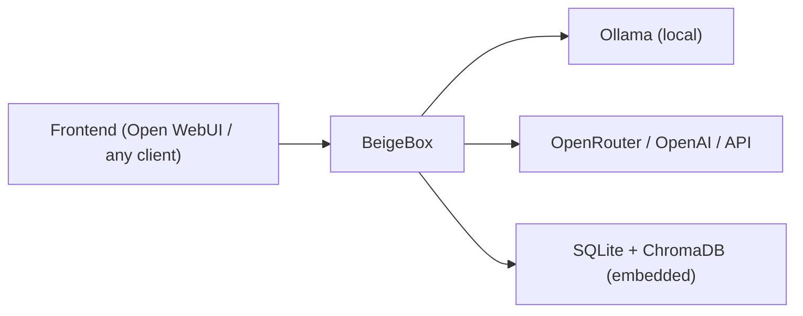

# BeigeBox

Modular, OpenAI-compatible LLM middleware. Sits between your frontend and your model providers — handles routing, orchestration, caching, logging, evaluation, and policy decisions while remaining transparent to both sides.

Tap the line. Control the carrier.



---

## Quick Start

```bash
git clone https://github.com/ralabarge/beigebox.git
cd beigebox/docker
cp env.example .env        # optional — set GPU, ports, API keys
docker compose up -d
```

This brings up three services plus a one-shot model pull:

| Service | Port | What it does |
|---|---|---|
| Ollama | `11434` | Local model inference |
| **BeigeBox** | `1337` | Middleware proxy + API + web UI + embedded vector store |
| Open WebUI | `3000` | Chat frontend (talks to BeigeBox, not Ollama directly) |

Open **http://localhost:1337** for BeigeBox's built-in web interface, or **http://localhost:3000** for Open WebUI.

The OpenAI-compatible API is at `http://localhost:1337/v1` — point any client at it.

### Voice support

```bash
docker compose --profile voice up -d
```

Adds Whisper (STT) on `:9000` and Kokoro (TTS) on `:8880` as sidecars. Enable in the Config tab or `runtime_config.yaml`.

### GPU acceleration

Uncomment the `deploy` block on the `ollama` service in `docker-compose.yaml` and restart. For per-model GPU layer control see [Per-model options](#per-model-options) below.

---

## What you get

Because all LLM traffic passes through BeigeBox, it can observe, route, modify, store, and orchestrate everything without your frontend or backend knowing it exists.

### Routing

Multi-tier routing pipeline that picks the right model per request:

1. **Z-commands** — user overrides inline (`z: complex`, `z: code`, `z: llama3:8b`)
2. **Agentic scorer** — zero-cost keyword pre-filter for tool-heavy queries
3. **Embedding classifier** — fast cosine-distance classification (~50ms) handles clear cases
4. **Decision LLM** — small local model judges borderline cases

Session-sticky routing keeps a conversation on the same model once classified. Multi-backend failover routes through Ollama, OpenRouter, or any OpenAI-compatible endpoint with priority-based fallback.

**Latency-aware routing** — each backend maintains a rolling P95 latency window (100 samples). Backends whose P95 exceeds a configurable threshold are deprioritised to a second-pass fallback, keeping traffic on healthy backends automatically.

**A/B traffic splitting** — assign `traffic_split` weights to backends for percentage-based traffic distribution. When weights are set, BeigeBox uses weighted random selection among healthy backends instead of strict priority order.

### Caching

Three complementary cache layers, all in-process:

- **Semantic cache** — caches full assistant responses keyed by cosine similarity of the user query (nomic-embed-text). When a new message is sufficiently similar to a cached one, the cached response is returned immediately without touching the backend. Configurable similarity threshold, TTL, and max entries.
- **Embedding cache** — deduplicates identical embedding calls within a session. Both the classifier and semantic cache need to embed the same message — this avoids redundant round-trips to Ollama.
- **Tool result cache** — short-TTL cache for deterministic tool calls (web search, calculator, datetime). Keyed by SHA-256 of tool name + query.

### Observability

- **Wiretap** — structured JSONL log of every request, response, routing decision, tool call, WASM transform, and timing breakdown
- **TTFT tracking** — time to first token captured on every streaming response, stored in SQLite
- **Latency percentiles** — P50/P90/P95/P99 per model surfaced in the Dashboard performance table and latency chart
- **Tokens/sec** — uses `tokens / (latency - TTFT)` for generation throughput (excludes prompt processing time)
- **Cost tracking** — per-request, per-model, per-day spend for API backends (OpenRouter cost extraction built in)
- **Backend health** — rolling P95 + degraded status per backend in `/api/v1/backends` and Dashboard

### Orchestration

- **Harness** — send the same prompt to N models in parallel, compare results side by side
- **Orchestrated mode** — goal-driven agent loop: plan → dispatch tasks to models/operator → evaluate → iterate
- **Ensemble voting** — parallel responses judged by an LLM arbiter, returns the best with reasoning
- **Operator agent** — JSON tool-loop agent with sandboxed shell, web search, memory recall, calculator, and plugin tools

### Storage

- **SQLite** — every conversation, message, cost, and latency metric persisted locally
- **ChromaDB** — vector embeddings for semantic search and classification (embedded, no separate service)
- **Conversation replay** — reconstruct any conversation with full routing context
- **Conversation forking** — branch a conversation into a new thread via `z: fork`

### Post-processing (WASM)

- **WASM transform modules** — drop a compiled `.wasm` (WASI target) into `wasm_modules/` and route responses through it; modules read the full response from stdin and write modified output to stdout
- **Streaming-correct** — when a WASM module is active, BeigeBox buffers the full stream internally, runs the transform, then re-emits to the client; the client always sees the transformed content, not the raw stream
- Any language that compiles to WASI works (Rust, C, Go, AssemblyScript)
- Timeout-enforced (configurable `timeout_ms`) — if the module times out, the original response passes through unmodified
- Decision LLM can suggest WASM modules per route via `[suggest wasm: <module>]` hints in the routing prompt
- Included example: `opener_strip` — strips sycophantic openers ("Certainly!", "Of course!", etc.)

### Hooks & Plugins

- **Pre/post hooks** — Python scripts that intercept requests and responses (prompt injection detection, RAG context injection, synthetic request filtering)
- **Plugin system** — drop a `*Tool` class in `plugins/` and it auto-registers into the tool registry
- **Zip inspector** — built-in plugin that reads `.zip` files from `workspace/in/`, returns file tree and UTF-8 text previews
- **System context injection** — hot-reloaded `system_context.md` prepended to every request

### Per-model options

Override Ollama inference settings per model name in `config.yaml`. Useful for GPU layer budgeting across multiple models:

```yaml
models:
  llama3.2:3b:
    options:
      num_gpu: 99          # offload all layers to GPU
  llama2:70b:
    options:
      num_gpu: 20          # partial offload — stay within VRAM budget
  mistral:7b:
    options:
      num_gpu: 0           # force CPU inference
      num_ctx: 8192
```

Any key in `options` is passed to Ollama's model loader. Settings take effect on next model load; use the **↺ reload** checkbox in the chat pane settings drawer to evict and reload immediately.

---

## Web UI


BeigeBox includes a built-in single-file web interface at `http://localhost:1337` with seven tabs:

| Tab | What it does |
|---|---|
| **Dashboard** | Storage stats, model performance charts (P50/P90/P99, TTFT), cost breakdown, backend health with rolling P95 |
| **Chat** | Multi-pane streaming chat — fan out to N models simultaneously, per-pane settings |
| **Conversations** | Semantic search, replay, fork, export |
| **Tap** | Live wiretap stream with role/direction filters |
| **Operator** | Interactive agent with tool execution |
| **Harness** | Parallel model comparison + orchestrated goal-driven mode + ensemble voting |
| **Config** | Full config editor with collapsible sections, hot-reload — every setting, feature flag, and generation parameter |

### Per-pane chat settings

Each chat pane has an independent ⚙ settings drawer. Configure separately per window:

| Setting | What it controls |
|---|---|
| Temperature, Top-P, Top-K | Sampling parameters for this pane only |
| Ctx, Max tokens, Repeat penalty | Context and output size overrides |
| GPU layers | `options.num_gpu` sent to Ollama for this pane's requests |
| **↺ reload** | Checkbox — evicts the model from VRAM before the next send so it reloads fresh with the new GPU layer count (one-shot, auto-clears) |
| System prompt | Per-pane system message, replaces the global system context for this window |

All settings inherit from global config when left blank. The ⚙ button glows when any non-default setting is active.

Optional vi-mode keybindings. Mobile-responsive. No JavaScript dependencies.


---

## CLI

Phreaker-themed commands, each with standard aliases:

```
beigebox dial          Start the proxy server (aliases: start, serve, up)
beigebox tap           Live wiretap stream (aliases: log, tail, watch)
beigebox ring          Ping a running instance (aliases: status, ping, health)
beigebox sweep         Semantic search over conversations (aliases: search, find)
beigebox dump          Export conversations to JSON (aliases: export)
beigebox flash         Stats and config at a glance (aliases: info, config, stats)
beigebox operator      Launch the operator agent (aliases: op)
beigebox setup         Pull required models into Ollama (aliases: install, pull)
beigebox build-centroids  Build embedding classifier centroids
beigebox tone          Print the banner
```

---

## Z-Commands

Prefix any chat message with `z:` to override routing, force tools, or branch conversations:

```
z: simple              Route to the fast model
z: complex             Route to the large model
z: code                Route to the code model
z: llama3:8b           Route to an exact model
z: search              Force web search and inject results
z: memory              Search past conversations for context
z: calc 2^32           Evaluate a math expression
z: sysinfo             Get system resource stats
z: fork                Fork this conversation into a new branch
z: complex,search      Chain multiple directives
z: help                Show all available commands
```

---

## Configuration

Two config files, by design:

- **`config.yaml`** — permanent infrastructure settings (backends, storage paths, model names, security policies). Loaded once at startup.
- **`runtime_config.yaml`** — session overrides (default model, temperature, voice toggle, vi mode). Hot-reloaded on every request via mtime check — no restart needed.

Everything in both files is editable from the web UI Config tab (collapsible sections, Save & Apply button).

### Key feature flags (all disabled by default)

```yaml
decision_llm.enabled: false       # Multi-tier routing pipeline
operator.enabled: false           # LLM-driven tool execution (review allowed_tools first)
auto_summarization.enabled: false # Context window management
cost_tracking.enabled: false      # Per-request spend tracking
backends_enabled: false           # Multi-backend routing with failover
web_ui.voice_enabled: false       # Push-to-talk STT/TTS
wasm.enabled: false               # WASM post-processing transform modules
semantic_cache.enabled: false     # Semantic response caching
```

### API key authentication

```yaml
auth:
  api_key: ""   # empty = disabled; set to a secret string to protect all endpoints
```

Accepts the key via `Authorization: Bearer <key>`, `api-key` header, or `?api_key=` query param. The web UI and health check endpoints are always exempt.

### A/B traffic splitting

```yaml
backends:
  - name: ollama-local
    traffic_split: 70    # 70% of traffic
  - name: vllm-secondary
    traffic_split: 30    # 30% of traffic
```

### Latency-aware routing

```yaml
backends:
  - name: ollama-local
    latency_p95_threshold_ms: 3000   # deprioritise if rolling P95 exceeds 3s
```

---

## Security

- **Operator sandboxing** — disabled by default; when enabled, tool access is restricted via `operator.allowed_tools` config
- **Shell hardening** — Python allowlist → bwrap namespace sandbox → busybox wrapper fallback → audit logging (four layers)
- **Prompt injection hooks** — configurable detection with scoring and blocking
- **API key auth** — single-key middleware, exempt paths for web UI and health checks
- **Non-root container** — runs as `appuser` (UID 1000)
- **No network in sandbox** — bwrap `--unshare-all` isolates shell commands from the network
- **Blocked patterns** — belt-and-suspenders regex blocking on top of the allowlist
- **Agent workspace** — `workspace/in/` is a tmpfs (RAM-only, never touches disk, auto-cleared on container stop); `workspace/out/` is a bind-mount for persistent agent results. Upload files to `workspace/in/` via the dashboard drag-and-drop zone or `POST /api/v1/workspace/upload`

---

## API

OpenAI-compatible endpoints — any client that speaks the OpenAI API works without modification:

```
POST /v1/chat/completions       Chat (streaming and non-streaming)
GET  /v1/models                 List available models
POST /v1/embeddings             Embeddings passthrough
POST /v1/audio/transcriptions   STT (routes to Whisper when voice profile active)
POST /v1/audio/speech           TTS (routes to Kokoro when voice profile active)
```

BeigeBox-specific endpoints:

```
GET  /api/v1/config                     Full merged config
POST /api/v1/config                     Hot-apply config changes
GET  /api/v1/stats                      Storage and usage statistics
GET  /api/v1/costs                      Cost breakdown by model/day/conversation
GET  /api/v1/search                     Semantic search grouped by conversation
GET  /api/v1/tap                        Wiretap log stream
GET  /api/v1/backends                   Backend health, rolling P95, degraded status
GET  /api/v1/model-performance          Tokens/sec, P50/P90/P95/P99 latency, TTFT, cache stats
GET  /api/v1/routing-stats              Session cache hit rate
POST /api/v1/operator                   Run the operator agent
POST /api/v1/ensemble                   Multi-model ensemble with LLM judge
POST /api/v1/harness/orchestrate        Goal-driven orchestration (SSE stream)
GET  /api/v1/conversation/{id}/replay   Full conversation reconstruction
POST /api/v1/conversation/{id}/fork     Branch a conversation
GET  /api/v1/workspace                  List workspace/in and workspace/out files
POST /api/v1/workspace/upload           Upload a file to workspace/in (multipart)
DELETE /api/v1/workspace/out/{file}     Delete a file from workspace/out
GET  /api/v1/openrouter/balance         Remaining credit balance for configured OR key
POST /api/v1/build-centroids            Rebuild embedding classifier centroids
```

Ollama-native endpoints (`/api/tags`, `/api/chat`, `/api/generate`, etc.) are forwarded transparently. A catch-all route forwards anything not explicitly handled — BeigeBox stays invisible.

---

## Project Structure

```
beigebox/
├── main.py                 FastAPI app — all endpoints
├── proxy.py                Core proxy — routing, streaming, hooks, WASM, caching, logging
├── cache.py                SemanticCache, EmbeddingCache, ToolResultCache
├── config.py               Config loader with hot-reload
├── cli.py                  CLI entry point
├── costs.py                Cost tracking
├── hooks.py                Pre/post hook manager
├── orchestrator.py         Parallel task orchestrator
├── replay.py               Conversation replay
├── summarizer.py           Auto-summarization
├── system_context.py       System prompt injection
├── wasm_runtime.py         WASM module loader and async transform runner
├── wiretap.py              Structured wire logging
├── agents/
│   ├── decision.py         Decision LLM (Tier 4 routing)
│   ├── embedding_classifier.py  Centroid classifier (Tier 3)
│   ├── agentic_scorer.py   Keyword pre-filter (Tier 2)
│   ├── zcommand.py         Z-command parser (Tier 1)
│   ├── operator.py         JSON tool-loop agent
│   ├── harness_orchestrator.py  Goal-driven orchestration
│   └── ensemble_voter.py   Multi-model voting with LLM judge
├── backends/
│   ├── router.py           Multi-backend router — failover, latency-aware, A/B splitting
│   ├── ollama.py           Ollama backend
│   ├── openai_compat.py    Generic OpenAI-compatible backend
│   ├── openrouter.py       OpenRouter (with cost extraction)
│   └── retry_wrapper.py    Retry logic with exponential backoff
├── storage/
│   ├── sqlite_store.py     Conversation + metrics persistence (TTFT, P50/P90/P99)
│   ├── vector_store.py     Embedding + semantic search
│   └── backends/           Vector backend abstraction (ChromaDB, extensible)
├── tools/
│   ├── registry.py         Tool dispatch + plugin loading
│   ├── system_info.py      System stats (bwrap sandboxed)
│   ├── memory.py           Conversation recall via vector search
│   ├── calculator.py       Math evaluation
│   ├── datetime_tool.py    Time/date
│   ├── web_search.py       DuckDuckGo search
│   ├── google_search.py    Google Custom Search
│   ├── web_scraper.py      Page content extraction
│   ├── ensemble.py         Ensemble tool for operator
│   ├── notifier.py         Webhook notifications
│   └── plugin_loader.py    Auto-discovery from plugins/
└── web/
    ├── index.html          Single-file web UI (no build step)
    └── vi.js               Optional vi-mode keybindings

plugins/
└── zip_inspector.py        Inspect .zip files from workspace/in/

workspace/
├── in/                     Drop files here — agents see /workspace/in (read-only)
└── out/                    Agents write here — retrieve results from host

wasm_modules/
├── passthrough/            Reference Rust/WASI module (stdin → stdout identity)
└── opener_strip/           Strips sycophantic openers from responses
```

---

## Requirements

- Docker and Docker Compose (recommended)
- Or: Python 3.11+, Ollama running locally

```bash
pip install -e .
beigebox dial
```

---

## License

AGPL-3.0. See [LICENSE.md](LICENSE.md) for the full text.

Commercial licensing available — reach out for proprietary use cases.
