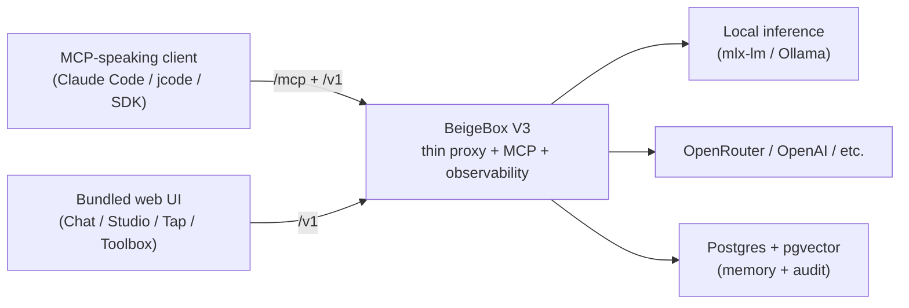

# BeigeBox **V3** — security-focused fork

[](./LICENSE.md)
[](https://www.python.org/downloads/)

> **You are looking at V3.** V3 is the active line — a smaller, sharper, security-focused refactor. It lives here at **`RALaBarge/beigebox-security`** on the `main` branch.
>
> **V2 is frozen** at [`RALaBarge/beigebox`](https://github.com/RALaBarge/beigebox). No new feature work, no breaking changes. Existing users on V2 stay on V2; cherry-picks come over only when truly needed.
>
> See [V3.md](./V3.md) for the full v2→v3 changelog and the reasoning behind every deletion.

BeigeBox is a thin, observable, OpenAI-compatible LLM proxy with a built-in MCP tool server, conversation memory, and a self-contained web UI.

**Tap the line. Control the carrier.**



---

## What V3 is — and isn't

V3 is the answer to "what does BeigeBox do that nothing else does?"

**It IS:**

- A **thin OpenAI-compatible proxy** (`/v1/chat/completions`, `/v1/models`) that forwards to any backend — OpenRouter, Ollama, mlx-lm, OpenAI-compat — with retry, latency-aware ordering, and streaming-safe failure handling.
- An **MCP tool server** (`/mcp`, plus opt-in `/pen-mcp`) so any MCP-speaking client can drive the bundled tools and skills.
- **Observability** for everything that flows through it — wiretap (SQLite + JSONL dual-write), per-request tracing, anomaly detection, RAG-poisoning detection, extraction-attack detection.
- A **self-contained web UI** for humans — Chat, Studio (rich playground), Tap (wire log), Security, Toolbox (MCP/skills inspector), Dashboard.

**It is NOT** (deliberately, see [BEIGEBOX_IS_NOT.md](./BEIGEBOX_IS_NOT.md)):

- **Not an agent harness.** Operator, orchestrate, harness/wiggam/ralph were all deleted in v3. Agent loops belong in the *driving client* (Claude Code, your SDK script, an IDE plugin) — not in the proxy. BeigeBox provides tools via MCP; the loop runs upstream.
- **Not a multi-tenant platform.** Single user, single config. The multi-key auth is for one operator who wants revocable keys, not for serving customers.
- **Not an inference engine.** Bring your own backend.
- **Not a fine-tuner / trainer.** Use upstream tooling.

---

## Quick start

V3's canonical deployment is a **debian LXC** with the proxy + Postgres + pgvector all in one container — see [docs/deployment.md](docs/deployment.md). Docker still works for v2-style setups.

### From source (the v3 way)

```bash
git clone https://github.com/RALaBarge/beigebox-security.git beigebox
cd beigebox

# 1. Python deps (uv recommended; pip works)
python3 -m venv .venv
.venv/bin/pip install -r requirements.txt

# 2. Postgres + pgvector — the only supported vector backend in v3
sudo apt install postgresql postgresql-17-pgvector
sudo -u postgres createuser beigebox -P            # set a password
sudo -u postgres createdb beigebox -O beigebox
sudo -u postgres psql -d beigebox -c "CREATE EXTENSION vector;"

# 3. Config — copy and edit
cp docker/config.yaml ./config.yaml
$EDITOR config.yaml                                 # set OR key / backend URLs / storage paths

# 4. Run
export OPENROUTER_API_KEY=sk-or-v1-...
.venv/bin/python -m beigebox.main                   # listens on :1337
```

Open **http://localhost:1337/ui**. The OpenAI-compatible API is at `http://localhost:1337/v1`. The MCP server is at `http://localhost:1337/mcp`.

### Production: systemd + LXC

A reference systemd unit + LXC bind-mount layout for putting beigebox on a NAS or dedicated host (data on a shared filesystem, autostart with the host) is in [docs/deployment.md](docs/deployment.md).

---

## What's in the box (v3)

| Surface | What it does |
|---|---|
| **`/v1/chat/completions`, `/v1/models`** | Thin proxy. `MultiBackendRouter` picks a provider by model pattern (`openai/*` → OpenRouter, `mlx-community/*` → mlx-lm, etc.), retries pre-stream, never replays a stream after the first chunk. |
| **`/mcp`** | General MCP tool server. Tools satisfy the [`Tool` Protocol](beigebox/tools/base.py) (runtime-checkable: `description: str` + `run(input_text) -> str \| dict`). |
| **`/pen-mcp`** | Opt-in MCP endpoint with 53 wrapped offensive-security tools (nmap, nuclei, ffuf, sqlmap, hydra, impacket suite, …). Authorization gate on destructive wrappers. See [beigebox/security_mcp/README.md](beigebox/security_mcp/README.md). |
| **Web UI (`/ui`)** | Six tabs, all working: **Dashboard** (subsystems + backends + workspace), **Tap** (wire log + conversations), **Chat** (single-pane chat), **Studio** (rich playground with model/temp/top-p controls + request preview), **Security** (audit + injection guard + RAG quarantine + extraction sessions + honeypots), **Toolbox** (MCP tools/skills inspector). |
| **Storage** | SQLite for conversations + audit (queryable). **Postgres + pgvector** for embeddings — the chromadb backend was removed in v3 for security reasons. |
| **Observability** | `Wiretap` dual-writes every request/response to SQLite + JSONL. `bb tap` tails live; `bb sweep <query>` does semantic search across past conversations; `bb flash` shows config + stats. |
| **Anomaly + extraction detection** | Pre-routing checks; observe-only by default. Logs to wiretap. |
| **RAG poisoning defense** | `RAGContentScanner` runs pre-embed (pattern + metadata + semantic). Quarantines suspicious documents before they hit the vector store. |
| **Hooks (`HookManager`)** | Generic pre/post-request hooks. Replaces the deleted Operator-specific hook plumbing with a single ordered registry any concern can plug into. |

---

## Skills

Importable async pipelines under `beigebox/skills/`. Each is a self-contained directory with `pipeline.py`, optional `cli.py`, and a `SKILL.md`.

| Skill | Purpose |
|---|---|
| **`fuzz`** | Pure-Python coverage-blind mutation fuzzer. Risk-scored discovery, adaptive time budget, package-aware harness loader. Crashes classified as app vs harness so missing deps don't surface as findings. |
| **`fanout`** | List-in → N parallel OpenAI-compat calls → optional reduce. Avoids the "reasoning model blew its budget on one giant prompt" failure mode. |
| **`host-audit`** | Cross-platform single-host audit of running containers / VMs / listening services. |
| **`services-inventory`** | Same audit, fleet-wide via SSH (`--host`, `--all-hosts`, `--json`). |
| **`host-notes`** | Per-host accumulated operator notes (gitignored). |
| **`grill-with-docs`** | Doc-driven interrogation pipeline. |
| **`improve-codebase-architecture`** | Architecture-review pipeline. |
| **`diagnose`**, **`make-skill`**, **`make-tool`** | Meta-skills for diagnosis and authoring new skills/tools. |

Skills are MCP-discoverable from any client connected to `/mcp`.

---

## Routing inference

Multi-backend by default. Each backend has a name, URL, priority, retry policy, and optional `allowed_models` pattern list.

```yaml
backends:
  - provider: openrouter
    name: openrouter-primary
    url: https://openrouter.ai/api/v1
    api_key: ${OPENROUTER_API_KEY}            # env-var interpolation supported
    priority: 1
    timeout_ms: 60000

  - provider: mlx
    name: mlx-mac
    url: http://100.116.194.94:8080            # tailnet IP works; LAN IP works; either way the backend is on the model host
    priority: 2
    timeout_ms: 300000

  - provider: ollama
    name: ollama-local
    url: http://localhost:11434
    priority: 3

routing:
  model_routes:
    - match: "openai/*"        # → OpenRouter
      backend: openrouter-primary
    - match: "anthropic/*"
      backend: openrouter-primary
    - match: "mlx-community/*" # → M1 mlx-lm
      backend: mlx-mac
    - match: "*:*"             # ollama-style "name:tag"
      backend: ollama-local
```

The router picks the highest-priority backend whose `allowed_models` matches; falls back to next priority on backend failure (pre-stream only). Latency-aware demotion is automatic.

See [docs/routing.md](docs/routing.md) for retry tuning, P95 demotion thresholds, and the full backend factory pattern.

---

## Security posture

V3 is the post-cleanup line where the architectural debt that made v2 a soft target got paid off. The H-batch (`H-1` through `H-7` in git history) closed:

- **Direct code-execution surfaces** — `tools/python_interpreter.py` deleted (untrusted code in the proxy was always wrong).
- **Filesystem-write tools** — `tools/workspace_file.py` deleted (the driving client owns filesystem operations).
- **Operator entry points** — `operator/run` MCP schema, dispatcher, and factory plumbing all removed (no in-tree agent loop = no in-tree agent attack surface).
- **Dead validators** — `mcp_parameter_validator.py` (924 LOC, never instantiated outside its own docstring) deleted; the live validator at `tools/validation.py:ParameterValidator` is the single source of truth.
- **Tool contract** — `tools/base.py:Tool` Protocol added with a runtime sanity check at registry init. Every registered tool must declare `description` + `run`. Five plugin contract violations were caught and fixed in the same commit.
- **Authoritative auth flag** — `auth.enabled` top-level kill switch added; `SimplePasswordAuth` deleted (only the multi-key registry remains, so there's one and only one auth path).

**Live AI security defenses** (all observe-only by default, configurable to block):

| Threat | Defense | Where |
|---|---|---|
| Prompt injection (direct) | Pattern + semantic scanner | `beigebox/security/enhanced_injection_guard.py` |
| RAG poisoning | Pre-embed content scan + magnitude-anomaly + centroid-distance | `beigebox/security/rag_content_scanner.py` |
| API key extraction | Token budget + anomaly detection | `beigebox/security/anomaly_detector.py` + `extraction_detector.py` |
| Tool-call injection | Per-tool parameter validator | `beigebox/tools/validation.py` |
| Honeypot trip-wires | Optional fake-credential trap manager | `beigebox/security/honeypot_manager.py` |

Inspect live state via `/api/v1/security/*` (Security tab in the UI). Routes return `{enabled: false, ...}` with HTTP 200 when an optional defense isn't configured — not a 503.

### Pen/Sec MCP

`POST /pen-mcp` is a separate MCP endpoint (off by default; `security_mcp.enabled: true` in `config.yaml`) that exposes 53 *nix offensive-security tool wrappers grouped by kill-chain phase. Built clean — argv-list `subprocess.run` only, no shell metachar concatenation, no f-string injection. Destructive tools (`hydra_attack`, `john_crack`, `hashcat_crack`, `netexec_scan`, all impacket AD tools, `msfvenom_generate`) require an explicit `"authorization": true` field in the input — the LLM cannot infer authorization from a vague prompt.

Inspired by [HexStrike AI](https://github.com/0x4m4/hexstrike-ai) but re-implemented without HexStrike's known shell-injection issues.

### Supply chain

Hash-locked deps via `requirements.lock`. CVE scanning via `./scripts/security-scan.sh` (pip-audit + bandit + semgrep + gitleaks + trivy).

---

## Configuration

Two config files:

- **`config.yaml`** — bake-time config. Backends, routing, storage paths, security defenses, feature toggles. Use `${VAR}` and `${VAR:-default}` for env-var interpolation (the OpenRouter key should always come from `OPENROUTER_API_KEY` in the env, never inline).
- **`data/runtime_config.yaml`** — hot-reload config. Session-level overrides (`force_route`, `tools_disabled`, `system_prompt_prefix`, log level, etc.). Re-read on every request via mtime check; no restart needed.

See [docs/configuration.md](docs/configuration.md) for the full schema and feature-flag reference.

---

## Tools — what's bundled

Every tool here is registered in `beigebox/tools/registry.py` and satisfies the `Tool` Protocol. All are discoverable via `/mcp`.

| Tool | What it does |
|---|---|
| `calculator` | Safe expression evaluator (no `eval`). |
| `datetime` | Current time/date. |
| `system_info` | Host platform / kernel / load / disk / mem. |
| `document_search` | Search ingested docs in vector store. |
| `memory` | Cross-session memory recall via `bb sweep` semantics. |
| `cdp` | Drive a headless Chrome via Chrome DevTools Protocol. |
| `web_search` / `web_scraper` | DDGS-backed search + page fetch. |
| `google_search` | Google Programmable Search backend. |
| `pdf_reader` | Extract text from PDFs in workspace/in. |
| `apex_analyzer` | Salesforce Apex code search + SOQL extraction. |
| `atlassian` / `confluence_crawler` | Confluence/Jira data access (with CDP path for SSO). |
| `network_audit` | Audited LAN discovery + IoT fingerprinting (RFC1918 + port-range + timeout-bound validated). |
| `bluetruth` | Bluetooth diagnostics + classification. |
| `aura_recon` | Salesforce Aura recon. |
| `api_anomaly_detector` | LLM-callable wrapper around the live anomaly detector. |
| `plan_manager` | Multi-step plan tracking (artifacts in workspace/out). |
| `parallel_research` / `research_agent` / `evidence_synthesis` | Multi-source research pipelines. |
| `browserbox` | Browser automation orchestration on top of `cdp`. |

Plus user-installable plugins in `plugins/` (auto-loaded if `tools.plugins.enabled: true`): `dice`, `doc_parser`, `repo`, `units`, `wiretap_summary`, `zip_inspector`. Plugins follow the same Tool Protocol contract.

See [docs/tools.md](docs/tools.md) for per-tool input formats and examples.

---

## Documentation

- **[V3.md](./V3.md)** — what changed v2→v3 and why
- **[BEIGEBOX_IS_NOT.md](./BEIGEBOX_IS_NOT.md)** — the constitution (single-tenant, not an inference engine, not an agent harness, …)
- **[docs/architecture.md](docs/architecture.md)** — request pipeline, subsystem map, what survives v3
- **[docs/configuration.md](docs/configuration.md)** — config.yaml + runtime_config.yaml reference
- **[docs/routing.md](docs/routing.md)** — multi-backend routing, retry, latency-aware demotion
- **[docs/authentication.md](docs/authentication.md)** — multi-key registry, admin gate, ACLs, agentauth keychain
- **[docs/agents.md](docs/agents.md)** — how external MCP clients drive BeigeBox (the v3 reframe)
- **[docs/tools.md](docs/tools.md)** — bundled tools, MCP server, CDP, plugins
- **[docs/security.md](docs/security.md)** — defenses, threat model, supply chain hardening
- **[docs/observability.md](docs/observability.md)** — wiretap event types, metrics, debugging
- **[docs/cli.md](docs/cli.md)** — `bb sweep`, `bb tap`, `bb ring`, `bb flash`, `bb dump`, `bb bench`, …
- **[docs/api-reference.md](docs/api-reference.md)** — HTTP endpoints + request/response shapes
- **[docs/deployment.md](docs/deployment.md)** — Docker, LXC, systemd
- **[Pen/Sec MCP](beigebox/security_mcp/README.md)** — offensive-security tool wrappers

---

## Development

```bash
.venv/bin/python -m beigebox.main             # production-style run
uvicorn beigebox.main:app --reload            # dev with auto-reload
pytest                                         # full test suite
.venv/bin/python -m beigebox.cli bench         # backend latency benchmark
```

The `bb` CLI lives at `beigebox/cli.py`. Run `bb --help` for the full command list (notable: `ring` for backend probe, `tap` for live wiretap, `sweep` for memory search, `flash` for stats, `eval`, `experiment`, `dump`, plus quarantine commands).

---

## License

Dual-licensed: **AGPL-3.0** (source available) and **Commercial** (proprietary).

For proprietary use cases, [open an issue](https://github.com/RALaBarge/beigebox-security/issues) — licensing is negotiable.

See [LICENSE.md](LICENSE.md).

---

## Why two repos?

V2 (`RALaBarge/beigebox`) is the line existing users are running. It accumulated bypass paths over time — Operator entry points, `python_interpreter`, `workspace_file`, plus dead validator surfaces — that v3 is closing one by one. Pushing v3 over v2 would break those users without warning.

V3 (`RALaBarge/beigebox-security`, this repo) is the post-cleanup line. New work happens here. When v3 is dubbed done, v2 gets a deprecation notice; until then both lines coexist.

If you're starting fresh, **use v3**. If you're already on v2 and it works for you, stay on v2 — there's no urgency to move.
