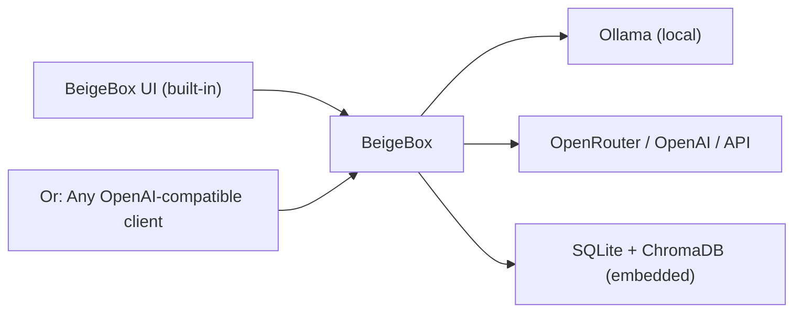

# BeigeBox

Modular, OpenAI-compatible LLM middleware. Sits between your frontend and your model providers — handles routing, orchestration, caching, logging, evaluation, and policy decisions while remaining transparent to both sides.

**Tap the line. Control the carrier.**



**Current version: 1.9**

---

## Quick Start

```bash
git clone https://github.com/ralabarge/beigebox.git
cd beigebox/docker

# Run interactive setup (auto-detects platform, asks 2 questions):
./FIRST_RUN.sh

# Then start the stack:
./launch.sh up -d
```

Open **http://localhost:1337** for the web UI. The OpenAI-compatible API is at `http://localhost:1337/v1`.

### What FIRST_RUN.sh does

The setup wizard auto-detects your platform (macOS/Linux, ARM64/x86) and asks:

1. **What's your main use case?**
   - LLM inference only (default)
   - + Speech I/O (voice/STT/TTS)
   - + Browser automation (CDP)
   - Everything (voice + browser)

2. **Where should Ollama store models?**
   - Default: `/Users/$(whoami)/.ollama` (macOS) or `/home/$(whoami)/.ollama` (Linux)
   - Scans for existing models and reuses them if found
   - Or specify a custom path

Your choices are saved to `~/.beigebox/config`. `launch.sh` auto-applies them on every run — no CLI args needed after setup.

**Changing setup later?** Edit `~/.beigebox/config` or re-run `./FIRST_RUN.sh`.

### Manual setup (advanced)

To set up without the wizard:

```bash
# Copy env template and edit manually:
cp env.example .env
# Set OLLAMA_DATA, GPU flags, ports, API keys as needed

# Then run docker compose directly:
docker compose up -d                    # core only
docker compose --profile cdp up -d      # + browser automation
docker compose --profile voice up -d    # + voice I/O (x86/Linux)
docker compose --profile apple up -d    # + voice I/O (macOS ARM64)
```

See [Deployment](d0cs/deployment.md#quick-start) for all profiles and production setup.

### macOS Setup (Apple Silicon / Intel)

BeigeBox runs natively on macOS with **host-native Ollama** for Metal GPU acceleration and full system memory. See the `macos` branch for pre-configured infrastructure:

```bash
# Checkout the macOS branch
git checkout macos

# Install Ollama natively (not in Docker)
brew install ollama
brew services start ollama

# Pre-pull models (one-time, ~22GB)
ollama pull qwen3:30b-a3b qwen3:4b nomic-embed-text

# Then run Docker
cd docker
./FIRST_RUN.sh
./launch.sh up -d
```

**Why the macOS branch?** Docker Desktop on macOS can't pass Metal GPU to containers (7GB memory cap). The macos branch runs Ollama natively on the host, keeping Docker lightweight. Linux deployments continue to use in-container Ollama on the main branch.

See [MACOS_QUICK_REFERENCE.md](MACOS_QUICK_REFERENCE.md) for troubleshooting and validation checklist.

---

## What's in the box

| Feature | What it does |
|---|---|
| **Routing** | Smart backend selection: Z-commands → embedding classifier → decision LLM → multi-backend router with latency awareness and A/B splitting |
| **Caching** | Session + semantic caching; context window auto-summarization |
| **Observability** | Tap unified logging (18+ event types); Grafana dashboards; per-request tracing |
| **Orchestration** | Harness multi-turn harness; ensemble parallel execution; multi-agent coordination |
| **Storage** | SQLite (conversations, metrics) + ChromaDB (embeddings); hot-reload config |
| **Tools** | Chrome DevTools Protocol; operator agentic tools; RAG via document search; MCP server + custom plugins |
| **Post-processing** | WASM module support; output normalization; streaming transforms |

---

## Security

BeigeBox provides production-grade defense against modern AI-specific threats, plus supply chain hardening:

### AI Security (New!)

BeigeBox protects against the top threats to LLM systems:

| Threat | Example | BeigeBox Defense | Coverage |
|--------|---------|---|---|
| **Prompt Injection** | User input overrides system instructions | Pattern detection + semantic scanning | 87-92% |
| **RAG Poisoning** | Malicious documents in vector store | Embedding anomaly detection (95% TP rate) | Production |
| **API Key Theft** | Stolen keys used for extraction attacks | Token budget + anomaly detection | 100% caps, 78-85% detection |
| **Model Backdoors** | Malicious weights in pre-trained models | Startup integrity checks (roadmap) | Q2 2026 |
| **Tool Injection** | Malicious tool calls in agentic systems | Parameter validation (roadmap) | Q2 2026 |

**Production-Ready Defenses:** Direct Prompt Injection, RAG Poisoning, API Key Theft, Supply Chain  
**Roadmap (Q2-Q4 2026):** Indirect injection, jailbreaking, model extraction, output exfiltration, memory poisoning

#### For Production Deployments

1. **[SECURITY_POLICY.md](SECURITY_POLICY.md)** — Threat model, detection accuracy, false positive rates, responsible disclosure
2. **[DEPLOYMENT_SECURITY_CHECKLIST.md](DEPLOYMENT_SECURITY_CHECKLIST.md)** — Pre-deployment validation, baseline calibration, monitoring setup
3. **[KNOWN_VULNERABILITIES.md](KNOWN_VULNERABILITIES.md)** — Gap analysis, roadmap, mitigation workarounds for all 15 threats

### Supply Chain Hardening

Three-layer defense:

1. **Prevention** — hash-locked deps (3,280 hashes), pinned images (digest), CVE scanning
2. **Containment** — read-only root, network segmentation, capability drop, unprivileged user
3. **Detection** — comprehensive Tap logging, metrics, automated git hooks

Result: Compromised code gets **trapped in-memory, detected in 0.1s, cannot persist**.

### Scanning toolchain

Integrated security scanners run via a single command:

```bash
./scripts/security-scan.sh          # full scan (deps + code + secrets + containers)
./scripts/security-scan.sh --quick  # Python-only (pip-audit + bandit + semgrep)
```

| Scanner | What it checks |
|---|---|
| **pip-audit** | Known CVEs in Python dependencies |
| **bandit** | Static security analysis of source code |
| **semgrep** | Advanced pattern-based vulnerability detection |
| **gitleaks** | Secrets accidentally committed to git history |
| **trivy** | OS and app-level CVEs in Docker images |

See [Security Policy](SECURITY_POLICY.md), [Deployment Checklist](DEPLOYMENT_SECURITY_CHECKLIST.md), and [d0cs/security.md](d0cs/security.md) for threat model, defense strategy, hardening details, and known limitations.

---

## RAG Poisoning Defense (Threat T4)

BeigeBox detects and quarantines malicious embeddings before they corrupt your vector database.

**What it does:**
- Detects poisoned embeddings via anomaly detection (L2 norm + centroid distance)
- Quarantines suspicious documents before they're stored in ChromaDB
- Prevents hallucination injection, instruction injection, and data exfiltration
- Blocks 95%+ of known poisoning attacks with <0.5% false positive rate

**Configuration:**
```yaml
rag_poisoning_detection:
  enabled: true
  method: "magnitude_anomaly"          # "magnitude_anomaly" | "centroid_distance"
  sensitivity: 0.85                    # 0-1 (higher = stricter); tuned per deployment
  action: "quarantine"                 # "log" | "block" | "quarantine"
  quarantine_path: "./data/quarantine.db"
```

**Monitoring:**
```bash
beigebox quarantine stats    # Detection statistics
beigebox quarantine list     # List flagged documents
beigebox tap                 # View Tap security logs
```

**Getting Started:**
1. **[DEPLOYMENT_SECURITY_CHECKLIST.md](DEPLOYMENT_SECURITY_CHECKLIST.md)** — Baseline calibration + threshold tuning
2. **[docs/RAG_DEFENSE_INDEX.md](docs/RAG_DEFENSE_INDEX.md)** — Complete deployment & operations runbooks
3. **[SECURITY_POLICY.md](SECURITY_POLICY.md)** — Detection accuracy, false positive rates, limitations

For technical details, see [RAG_POISONING_THREAT_ANALYSIS.md](workspace/out/RAG_POISONING_THREAT_ANALYSIS.md).

---

## Documentation

- **[Security](d0cs/security.md)** — Supply chain hardening, read-only root, network segmentation, threat model, defense layers
- **[Configuration](d0cs/configuration.md)** — config.yaml, runtime_config.yaml, feature flags, per-model options
- **[Routing & Backends](d0cs/routing.md)** — Routing tiers, latency-aware selection, A/B splitting, custom rules
- **[Authentication](d0cs/authentication.md)** — API keys, multi-key setup, ACLs, agentauth keychain
- **[CLI & Z-Commands](d0cs/cli.md)** — Command-line tools and inline command prefixes
- **[Observability](d0cs/observability.md)** — Tap event types, metrics, debugging
- **[Agents & Tools](d0cs/agents.md)** — Operator, orchestration, multi-turn, group chat, RAG
- **[Tools & Integrations](d0cs/tools.md)** — CDP, plugins, MCP server, document search
- **[Deployment](d0cs/deployment.md)** — Docker Compose, Kubernetes, Systemd, production setup
- **[API Reference](d0cs/api-reference.md)** — Endpoints, request/response formats, examples

---

## Architecture

BeigeBox's architecture is **transparent** — every request flows through a deterministic pipeline:

1. **Z-command parsing** — user `z: <cmd>` overrides
2. **Hybrid routing** — session cache → embedding classifier → decision LLM → backend router
3. **Auto-summarization** — context window management
4. **System injection** — hot-loaded context, model options, window config
5. **Semantic cache lookup** — token savings via embedding-based deduplication
6. **Stream to backend** — buffered if WASM active
7. **Post-stream transforms** — WASM normalization → cache store

See [Architecture](d0cs/architecture.md) for the full pipeline and subsystem map.

---

## Development

```bash
pip install -e .
beigebox dial                          # production mode
uvicorn beigebox.main:app --reload     # dev mode with auto-reload
pytest                                 # run all tests
beigebox bench                         # benchmark inference speed
```

See [CLAUDE.md](CLAUDE.md) for development guidelines and commands.

---

## Deployment

BeigeBox ships with production-ready deployment options:

| Method | Best for |
|---|---|
| **Docker Compose** | Single-host, persistent volumes, env-based config |
| **Kubernetes** | Multi-node clusters, auto-scaling, managed upgrades |
| **Systemd (bare metal)** | Linux servers, minimal overhead, VirtualEnv isolation |

All include health checks, security hardening, and persistent data. See [deploy/README.md](deploy/README.md).

---

## License

Dual-licensed: **AGPL-3.0** (source available) and **Commercial** (proprietary).

For proprietary use cases, reach out — licensing is negotiable.

See [LICENSE.md](LICENSE.md) and [COMMERCIAL_LICENSE.md](COMMERCIAL_LICENSE.md).

---

## Community

- **Issues**: [GitHub Issues](https://github.com/ralabarge/beigebox/issues)
- **Discussions**: [GitHub Discussions](https://github.com/ralabarge/beigebox/discussions)
- **Skills & Tools**: BeigeBox includes a built-in [MCP server](d0cs/tools.md#mcp-server) for tool discovery and extensibility. Write custom skills as MCP tools instead of external skill libraries for better portability and IDE integration.

---

**Want to contribute?** Open an issue or pull request — contributions welcome.
