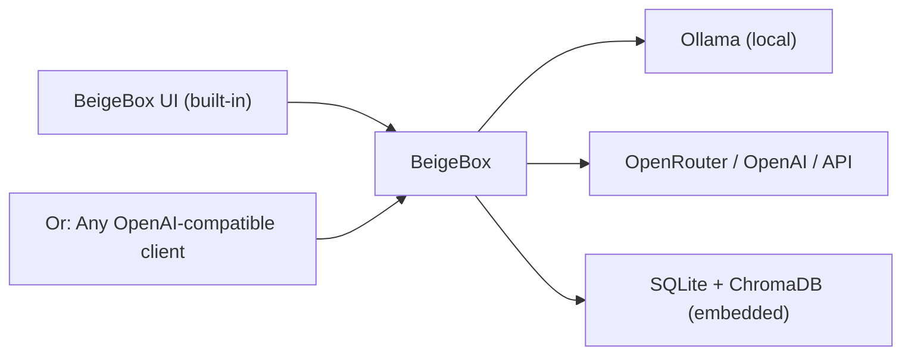

# BeigeBox

[](https://github.com/RALaBarge/beigebox/actions/workflows/docker-build.yml) [](https://github.com/RALaBarge/beigebox/actions/workflows/security.yml) [](./LICENSE.md) [](https://www.python.org/downloads/) [](https://github.com/RALaBarge/beigebox/pkgs/container/beigebox)

Modular, OpenAI-compatible LLM middleware. Sits between your frontend and your model providers — handles routing, orchestration, caching, logging, evaluation, and policy decisions while remaining transparent to both sides.

**Tap the line. Control the carrier.**



**Current version: 1.9**

---

## Installation

Choose the distribution channel that best fits your workflow:

### Option 1: Homebrew (macOS/Linux CLI)
```bash
brew tap RALaBarge/homebrew-beigebox
brew install beigebox
beigebox dial  # start the server
```

### Option 2: PyPI (Python environments)
```bash
pip install beigebox
beigebox dial
```

### Option 3: Docker (Containerized deployment)
```bash
docker run -d -p 1337:1337 ralabarge/beigebox:1.3.5
# Open http://localhost:1337
```

### Option 4: From source (development)
```bash
git clone https://github.com/RALaBarge/beigebox.git
cd beigebox
pip install -e .
```

---

## Quick Start

```bash
git clone https://github.com/ralabarge/beigebox.git
cd beigebox/docker

# Run interactive setup and start the stack:
./launch.sh up -d
```

Open **http://localhost:1337** for the web UI. The OpenAI-compatible API is at `http://localhost:1337/v1`.

### What launch.sh setup does

The setup wizard (first run only) auto-detects your platform (macOS/Linux, ARM64/x86) and asks:

1. **What optional features do you want?**
   - None (LLM inference only) — default
   - + Browser automation (CDP)

2. **Where should Ollama store models?**
   - Default: `/Users/$(whoami)/.ollama` (macOS) or `/home/$(whoami)/.ollama` (Linux)
   - Scans for existing models and reuses them if found
   - Or specify a custom path

Your choices are saved to `~/.beigebox/config` (user-level, shared across all BeigeBox versions). `launch.sh` auto-applies them on every run — no CLI args needed after setup.

**Changing setup later?** Run `./launch.sh --reset up -d` to re-run the wizard.

### Manual setup (advanced)

To set up without the wizard:

```bash
# Copy env template and edit manually:
cp env.example .env
# Set OLLAMA_DATA, GPU flags, ports, API keys as needed

# Then run docker compose directly:
docker compose up -d                    # core only
docker compose --profile cdp up -d      # + browser automation
```

See [Deployment](d0cs/deployment.md#quick-start) for all profiles and production setup.

### macOS Setup (Apple Silicon / Intel)

BeigeBox runs natively on macOS with **host-native Ollama** for Metal GPU acceleration and full system memory. See the `macos` branch for pre-configured infrastructure:

```bash
# Checkout the macOS branch
git checkout macos

# Install Ollama natively (not in Docker)
brew install ollama
brew services start ollama

# Pre-pull models (one-time)
ollama pull llama3.2:3b nomic-embed-text

# Then run Docker
cd docker
./launch.sh up -d
```

**Why the macOS branch?** Docker Desktop on macOS can't pass Metal GPU to containers (7GB memory cap). The macos branch runs Ollama natively on the host, keeping Docker lightweight. Linux deployments continue to use in-container Ollama on the main branch.

See [MACOS_QUICK_REFERENCE.md](MACOS_QUICK_REFERENCE.md) for troubleshooting and validation checklist.

---

## What's in the box

| Feature | What it does |
|---|---|
| **Routing** | Smart backend selection: Z-commands → embedding classifier → decision LLM → multi-backend router with latency awareness and A/B splitting |
| **Caching** | Session + semantic caching; context window auto-summarization |
| **Observability** | Tap unified logging (18+ event types); Grafana dashboards; per-request tracing |
| **Orchestration** | Harness multi-turn harness; ensemble parallel execution; multi-agent coordination |
| **Storage** | SQLite (conversations, metrics) + ChromaDB (embeddings); hot-reload config |
| **Tools** | Chrome DevTools Protocol (with vision-content screenshots + `wait_for_selector`); operator agentic tools; RAG via document search; primary MCP server + custom plugins |
| **Pen/Sec MCP** | Optional second MCP endpoint at `/pen-mcp` exposing 53 offensive-security tool wrappers (nmap, nuclei, sqlmap, ffuf, amass, impacket, hydra, …). Off by default. See [security_mcp/README.md](beigebox/security_mcp/README.md) |
| **Browser automation** | Built-in CDP tool + project-level Playwright MCP (`.mcp.json`) for headless Chromium driving with vision feedback to Claude Code/Desktop |
| **Post-processing** | WASM module support; output normalization; streaming transforms |

---

## Security

BeigeBox provides production-grade defense against modern AI-specific threats, plus supply chain hardening:

### AI Security (New!)

BeigeBox protects against the top threats to LLM systems:

| Threat | Example | BeigeBox Defense | Coverage |
|--------|---------|---|---|
| **Prompt Injection** | User input overrides system instructions | Pattern detection + semantic scanning | 87-92% |
| **RAG Poisoning** | Malicious documents in vector store | Embedding anomaly detection (95% TP rate) | Production |
| **API Key Theft** | Stolen keys used for extraction attacks | Token budget + anomaly detection | 100% caps, 78-85% detection |
| **Model Backdoors** | Malicious weights in pre-trained models | Startup integrity checks (roadmap) | Q2 2026 |
| **Tool Injection** | Malicious tool calls in agentic systems | Parameter validation (roadmap) | Q2 2026 |

**Production-Ready Defenses:** Direct Prompt Injection, RAG Poisoning, API Key Theft, Supply Chain  
**Roadmap (Q2-Q4 2026):** Indirect injection, jailbreaking, model extraction, output exfiltration, memory poisoning

#### For Production Deployments

1. **[SECURITY_POLICY.md](SECURITY_POLICY.md)** — Threat model, detection accuracy, false positive rates, responsible disclosure
2. **[DEPLOYMENT_SECURITY_CHECKLIST.md](DEPLOYMENT_SECURITY_CHECKLIST.md)** — Pre-deployment validation, baseline calibration, monitoring setup
3. **[KNOWN_VULNERABILITIES.md](KNOWN_VULNERABILITIES.md)** — Gap analysis, roadmap, mitigation workarounds for all 15 threats

### Supply Chain Hardening

Four-layer defense:

1. **Prevention** — hash-locked deps, pinned images (digest), CVE scanning, critical libraries extracted
2. **Containment** — read-only root, network segmentation, capability drop, unprivileged user
3. **Detection** — comprehensive Tap logging, metrics, automated git hooks
4. **Elimination** — zero external dependencies in AMF coordinator; minimal deps in Beigebox Python app

Result: Compromised code gets **trapped in-memory, detected in 0.1s, cannot persist**.

### Scanning toolchain

Integrated security scanners run via a single command:

```bash
./scripts/security-scan.sh          # full scan (deps + code + secrets + containers)
./scripts/security-scan.sh --quick  # Python-only (pip-audit + bandit + semgrep)
```

| Scanner | What it checks |
|---|---|
| **pip-audit** | Known CVEs in Python dependencies (also gated automatically by the `pre-push` git hook) |
| **bandit** | Static security analysis of source code |
| **semgrep** | Advanced pattern-based vulnerability detection |
| **gitleaks** | Secrets accidentally committed to git history |
| **trivy** | OS and app-level CVEs in Docker images |

### Dependency Extraction (Critical Libraries)

**Zero external dependencies in AMF coordinator.** The Go coordinator extracts and internalizes critical dependencies to eliminate supply chain attacks at the event fabric and discovery layers:

| Library | Extracted | Status |
|---------|-----------|--------|
| **NATS** (event fabric) | ✅ Yes | `internal/nats/client.go` (350 LOC, no auth) |
| **mDNS** (agent discovery) | ✅ Yes | `internal/mdns/mdns.go` (300 LOC) |
| **DNS** (DNS-SD lookups) | ✅ Yes | `internal/dns/dns.go` (200 LOC) |
| **UUID** (ID generation) | ✅ Yes | `stack/id.go` (18 LOC, stdlib crypto/rand) |

**Security benefit:** Compromised NATS, zeroconf, or miekg/dns releases cannot affect the coordinator. The extracted code:
- Is reviewed and locked to a point-in-time snapshot (no auto-updates)
- Has zero reliance on transitive dependencies
- Uses only Go stdlib (crypto/rand, net, encoding/json)
- Implements stable, well-specified protocols (RFC 4122, RFC 1035, RFC 6762)

**Trade-off:** Maintenance burden for critical I/O paths is accepted because:
1. Protocols are stable (rarely change)
2. Supply chain risk is eliminated (worth the cost)
3. AMF runs on isolated networks (minimal exposure)

See [amf/stack/EXTRACTED_SOURCES.md](amf/stack/EXTRACTED_SOURCES.md) for detailed extraction log and maintenance notes.

See [Security Policy](SECURITY_POLICY.md), [Deployment Checklist](DEPLOYMENT_SECURITY_CHECKLIST.md), and [d0cs/security.md](d0cs/security.md) for threat model, defense strategy, hardening details, and known limitations.

---

## RAG Poisoning Defense (Threat T4)

BeigeBox detects and quarantines malicious embeddings before they corrupt your vector database.

**What it does:**
- Detects poisoned embeddings via anomaly detection (L2 norm + centroid distance)
- Quarantines suspicious documents before they're stored in ChromaDB
- Prevents hallucination injection, instruction injection, and data exfiltration
- Blocks 95%+ of known poisoning attacks with <0.5% false positive rate

**Configuration:**
```yaml
rag_poisoning_detection:
  enabled: true
  method: "magnitude_anomaly"          # "magnitude_anomaly" | "centroid_distance"
  sensitivity: 0.85                    # 0-1 (higher = stricter); tuned per deployment
  action: "quarantine"                 # "log" | "block" | "quarantine"
  quarantine_path: "./data/quarantine.db"
```

**Monitoring:**
```bash
beigebox quarantine stats    # Detection statistics
beigebox quarantine list     # List flagged documents
beigebox tap                 # View Tap security logs
```

**Getting Started:**
1. **[DEPLOYMENT_SECURITY_CHECKLIST.md](DEPLOYMENT_SECURITY_CHECKLIST.md)** — Baseline calibration + threshold tuning
2. **[docs/RAG_DEFENSE_INDEX.md](docs/RAG_DEFENSE_INDEX.md)** — Complete deployment & operations runbooks
3. **[SECURITY_POLICY.md](SECURITY_POLICY.md)** — Detection accuracy, false positive rates, limitations

For technical details, see [RAG_POISONING_THREAT_ANALYSIS.md](workspace/out/RAG_POISONING_THREAT_ANALYSIS.md).

---

## Pen/Sec MCP (offensive tooling)

A second, opt-in MCP endpoint mounted at `POST /pen-mcp` exposes 53 wrapped *nix offensive-security tools. Separate registry from the default `/mcp` surface so security tooling stays out of normal LLM tool lists. Built clean (argv-list `subprocess.run` only — no shell metachar concatenation, no f-string injection), with conservative target/arg validation and structured-error returns when binaries aren't installed.

**Tool surface** (organized by kill-chain phase):

| Category | Tools |
|---|---|
| Network discovery | `nmap_scan` (auto -sT fallback when non-root), `nmap_advanced_scan`, `masscan_scan`, `rustscan_scan`, `fierce_scan`, `dnsenum_scan` |
| Subdomain / asset | `amass_scan`, `subfinder_scan`, `httpx_probe`, `wafw00f_scan` |
| Web vuln / fuzz / crawl | `nuclei_scan`, `katana_crawl`, `ffuf_scan`, `gobuster_scan`, `feroxbuster_scan`, `dirsearch_scan`, `nikto_scan`, `sqlmap_scan`, `dalfox_xss_scan`, `wpscan_scan` |
| URL / param discovery | `gau_discovery`, `waybackurls_discovery`, `arjun_parameter_discovery`, `paramspider_mining`, `hakrawler_crawl` |
| SSL/TLS / SSH audit | `testssl_scan`, `sslscan_scan`, `ssh_audit_scan` |
| SMB / NetBIOS / LDAP / SNMP | `enum4linux_scan`, `enum4linux_ng_scan`, `smbmap_scan`, `netexec_scan`, `snmpwalk_scan`, `onesixtyone_scan`, `nbtscan_scan`, `ldapsearch_scan` |
| AD / Kerberos | `impacket_secretsdump`, `impacket_getuserspns`, `impacket_getnpusers`, `kerbrute_userenum` |
| Credentials / cracking | `hydra_attack`, `john_crack`, `hashcat_crack` |
| OSINT / exploit lookup | `whatweb_scan`, `searchsploit_lookup`, `theharvester_scan`, `cewl_wordlist_gen`, `msfvenom_generate` |
| Binary / forensics | `binwalk_analyze`, `exiftool_extract`, `checksec_analyze` |
| ProjectDiscovery extras | `naabu_scan`, `dnsx_resolve` |

**Authorization gate.** Destructive wrappers (`hydra_attack`, `john_crack`, `hashcat_crack`, `netexec_scan`, all impacket AD tools, `msfvenom_generate`) require an explicit `"authorization": true` field in the input — prevents the LLM from inferring authorization from a vague prompt.

**Enable** in `config.yaml`:
```yaml
security_mcp:
  enabled: true
```

**Register with Claude Code** in `.mcp.json`:
```json
{
  "mcpServers": {
    "beigebox-pensec": {
      "url": "http://localhost:1337/pen-mcp",
      "headers": {"Authorization": "Bearer YOUR_BEIGEBOX_KEY"}
    }
  }
}
```

Inspired by [HexStrike AI](https://github.com/0x4m4/hexstrike-ai) (MIT) — re-implemented cleanly without HexStrike's known shell-injection issues. Full install line and per-tool JSON schemas in [beigebox/security_mcp/README.md](beigebox/security_mcp/README.md).

---

## Skills

BeigeBox ships a `beigebox/skills/` library: importable async pipelines that any orchestrator (Trinity, the CLI, an MCP tool) can call with one line. Each skill is a directory with `pipeline.py`, `cli.py`, a `SKILL.md`, and a wrapper at `scripts/<name>.sh`.

| Skill | Purpose | Entry |
|---|---|---|
| **`fuzz`** | Pure-Python coverage-blind mutation fuzzer. Discovers top-level fuzzable functions in a repo, risk-scores them, allocates per-function time budget, runs subprocess harnesses with a package-aware loader, classifies crashes as app vs harness so missing deps don't surface as findings. | `python -m beigebox.skills.fuzz <repo>` |
| **`static`** | Static analysis: ruff (full ruleset incl. bandit-port `S` rules), semgrep (registry-backed pattern + dataflow), mypy (type checking). Three concurrent subprocess runners; per-runner failure isolation. | `python -m beigebox.skills.static <repo>` |
| **`fanout`** | List-in → N parallel OpenAI-compat calls → optional reduce. Solves the "reasoning model blew its budget on a 13-file prompt" failure mode by splitting into one call per item. | `python -m beigebox.skills.fanout --items-glob ...` |
| **`host-audit`** | Cross-platform audit of running containers/VMs and listening services on a single host. | `beigebox/skills/host-audit/scripts/audit.sh` |
| **`services-inventory`** | Same audit, fleet-wide via SSH (`--host`, `--hosts`, `--all-hosts`). | `beigebox/skills/services-inventory/scripts/inventory.sh` |

`fuzz` and `static` emit the same `garlicpress.Finding`-shape dicts so a Trinity orchestrator can merge static + dynamic results into one ranked report without translation. The contract is documented per-skill in `beigebox/skills/<name>/SKILL.md`.

**Validation**: see [docs/portfolio/fuzz-static-validation.md](docs/portfolio/fuzz-static-validation.md) — six-repo pass (~131M fuzz iterations, 50 high-severity static findings, zero fuzz false positives, two real fuzz findings).

---

## Documentation

- **[Security](d0cs/security.md)** — Supply chain hardening, read-only root, network segmentation, threat model, defense layers
- **[Configuration](d0cs/configuration.md)** — config.yaml, runtime_config.yaml, feature flags, per-model options
- **[Routing & Backends](d0cs/routing.md)** — Routing tiers, latency-aware selection, A/B splitting, custom rules
- **[Authentication](d0cs/authentication.md)** — API keys, multi-key setup, ACLs, agentauth keychain
- **[CLI & Z-Commands](d0cs/cli.md)** — Command-line tools and inline command prefixes
- **[Observability](d0cs/observability.md)** — Tap event types, metrics, debugging
- **[Agents & Tools](d0cs/agents.md)** — Operator, orchestration, multi-turn, group chat, RAG
- **[Tools & Integrations](d0cs/tools.md)** — CDP, plugins, MCP server, document search
- **[Pen/Sec MCP](beigebox/security_mcp/README.md)** — Offensive-security tool wrappers via the optional `/pen-mcp` endpoint
- **[Deployment](d0cs/deployment.md)** — Docker Compose, Kubernetes, Systemd, production setup
- **[API Reference](d0cs/api-reference.md)** — Endpoints, request/response formats, examples

---

## Distribution

BeigeBox is distributed across **three channels** for flexibility:

| Channel | Best for | Install |
|---|---|---|
| **Homebrew** | macOS/Linux CLI tools | `brew tap RALaBarge/homebrew-beigebox && brew install beigebox` |
| **PyPI** | Python environments, pip-based deployments | `pip install beigebox` |
| **Docker Hub** | Containerized deployments, Kubernetes, production | `docker pull ralabarge/beigebox:1.3.5` |

**Verify your installation** across all channels:
```bash
./scripts/verify_distributions.sh        # full verification
./scripts/verify_distributions.sh --pip  # test PyPI only
./scripts/verify_distributions.sh --docker  # test Docker only
./scripts/verify_distributions.sh --brew # test Homebrew only
```

See [homebrew-beigebox/README.md](homebrew-beigebox/README.md) for Homebrew tap details.

---

## Architecture

BeigeBox's architecture is **transparent** — every request flows through a deterministic pipeline:

1. **Z-command parsing** — user `z: <cmd>` overrides
2. **Hybrid routing** — session cache → embedding classifier → decision LLM → backend router
3. **Auto-summarization** — context window management
4. **System injection** — hot-loaded context, model options, window config
5. **Semantic cache lookup** — token savings via embedding-based deduplication
6. **Stream to backend** — buffered if WASM active
7. **Post-stream transforms** — WASM normalization → cache store

See [Architecture](d0cs/architecture.md) for the full pipeline and subsystem map.

---

## Development

```bash
pip install -e .
beigebox dial                          # production mode
uvicorn beigebox.main:app --reload     # dev mode with auto-reload
pytest                                 # run all tests
beigebox bench                         # benchmark inference speed
```

See [CLAUDE.md](CLAUDE.md) for development guidelines and commands.

---

## Deployment

BeigeBox ships with production-ready deployment options:

| Method | Best for |
|---|---|
| **Docker Compose** | Single-host, persistent volumes, env-based config |
| **Kubernetes** | Multi-node clusters, auto-scaling, managed upgrades |
| **Systemd (bare metal)** | Linux servers, minimal overhead, VirtualEnv isolation |

All include health checks, security hardening, and persistent data. See [deploy/README.md](deploy/README.md).

---

## License

Dual-licensed: **AGPL-3.0** (source available) and **Commercial** (proprietary).

For proprietary use cases, reach out — licensing is negotiable.

See [LICENSE.md](LICENSE.md) and [COMMERCIAL_LICENSE.md](COMMERCIAL_LICENSE.md).

---

## Community

- **Issues**: [GitHub Issues](https://github.com/ralabarge/beigebox/issues)
- **Discussions**: [GitHub Discussions](https://github.com/ralabarge/beigebox/discussions)
- **Skills & Tools**: BeigeBox includes a built-in [MCP server](d0cs/tools.md#mcp-server) for tool discovery and extensibility. Write custom skills as MCP tools instead of external skill libraries for better portability and IDE integration.

---

**Want to contribute?** Open an issue or pull request — contributions welcome.
